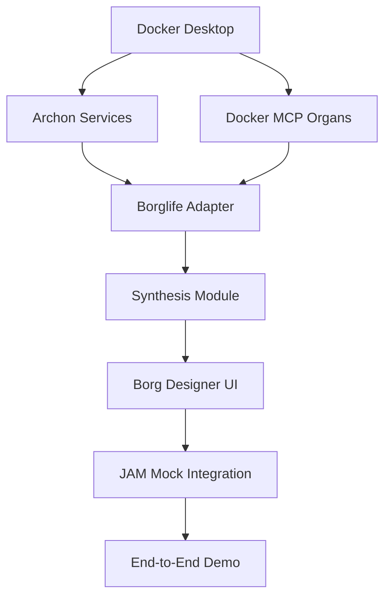

# BorgLife-Archon Integration: Comprehensive Technical Architecture & Implementation Strategy

## Executive Summary

After intensive analysis of the BorgLife whitepaper (sections 4-7, 10) and deep technical evaluation of Archon's architecture, this document provides a definitive integration strategy that aligns BorgLife's multi-agent coordination requirements with Archon's distributed agent orchestration capabilities. The recommendation leverages Archon as the **Off-Chain Synthesis Layer** (Section 4.2.1 of whitepaper) while maintaining architectural flexibility for BorgLife's evolution through Phase 3.

**Core Recommendation: Strategic External Service Integration with Archon as Synthesis Engine**

---

## Part 1: Architectural Alignment Analysis

### 1.1 BorgLife Architecture Requirements (Whitepaper Sections 4-7)

#### Section 4: Strategic Architecture - Three-Layer Model

**Layer 1: On-Chain (JAM)**
- Trustless execution via refine/accumulate phases
- DNA storage (hashes), wealth tracking (Δ(W) = R - C)
- Coretime bidding, XCM settlements
- Epoch-based (~6 hours), deterministic

**Layer 2: Off-Chain Synthesis (Archon's Role)**
- **Primary Function**: Build executable borg phenotypes from DNA
- **Key Requirements**:
  - Parse PVM bytecode → Python classes (cells) + LangGraph subgraphs (organs)
  - Support PydanticAI agents for cell logic
  - MCP server integration for organ modularity
  - Real-time synthesis without JAM gas constraints
  - Sandbox validation for DNA-phenotype integrity
  - Support for iterative design (Archon UI)

**Layer 3: Off-Chain Ecosystem**
- Bidirectional DNA↔phenotype mappings
- Libp2p for P2P coordination (mating markets, organ trading)
- Feedback loops (Δ(W) analysis → Γ(D) refinements)
- WebSocket orchestration for inter-borg swarms

#### Section 5: Technical Specifications

**Borg DNA Structure (D = (H, C, O, M))**
- H: Header (gas limits, service index)
- C: Cells (GP-evolved subroutines, "secret sauce")
- O: Organs (MCP pointers: URL/hash, ABI, price caps)
- M: Hash of Universal Principles manifesto

**Phenotype-Genotype Mappings**
- Forward: DNA → Phenotype (Archon parses PVM, generates Python classes/LangGraph)
- Reverse: Phenotype → DNA (serialize to YAML → compile to PVM)
- Round-trip integrity: H(D') = H(D)

**Evolution Lifecycle**
- Clone → Γ(D) (mutate/recombine) → Evaluate → Select (Δ(W) > 0) → Accumulate
- Mating markets: Crossover on C, swaps on O
- Swarm representation: LangGraph (intra-borg) + libp2p (inter-borg)

#### Section 6: Resource Autonomy

**Cost Management (Δ(W) = R - C)**
- Off-chain: Supabase/IPFS, LLM calls (stablecoins)
- On-chain: Coretime bids (DOT)
- Organ pricing: P2P gossip via Φ(O, P)

**Coordination**
- Tribal pools for shared organ access
- XCM for cross-chain settlements
- MCP servers on cloud/IPFS

#### Section 7: Privacy & Security

- Selective transparency: DNA hashes public, logs off-chain (encrypted)
- TEEs for sensitive MCP calls
- ZK-SNARKs for ethical compliance proofs
- Ex post oracles for Ψ(E) evaluation

### 1.2 Archon Architecture Capabilities

#### Core Microservices (Analyzed from `/home/m888888b/archon/python/src`)

**1. Server (FastAPI) - Port 8181**
- **Location**: `src/server/main.py` (354 lines)
- **Capabilities**:
  - Web crawling (crawl4ai integration)
  - Document processing (PDFs, markdown, YAML)
  - Vector search (Supabase PGVector)
  - RAG strategies (hybrid search, contextual embeddings, reranking)
  - Project/task management
  - Real-time progress tracking (HTTP polling with ETag caching)
- **Stable Integration Points**:
  - `/api/knowledge/*` - Document storage, RAG queries
  - `/api/projects/*` - Project/task CRUD
  - `/api/progress/{id}` - Operation tracking
  - `/health` - Service health checks
- **BorgLife Alignment**:
  - ✅ Document processing → Cell logic assembly
  - ✅ Vector search → Knowledge base for DNA design
  - ✅ Task management → Bounty tracking
  - ✅ Progress tracking → Synthesis monitoring

**2. MCP Server (Lightweight HTTP) - Port 8051**
- **Location**: `src/mcp_server/mcp_server.py` (FastMCP framework)
- **Capabilities**:
  - 10+ MCP tools (RAG, projects, tasks, documents, features)
  - HTTP-based protocol (no stdio complexity)
  - Tool registration system for extensibility
  - Service discovery integration
- **Stable Integration Points**:
  - `archon:perform_rag_query` - Semantic search
  - `archon:search_code_examples` - Code extraction
  - `archon:create_task`, `archon:list_tasks` - Task management
  - `archon:create_project`, `archon:list_projects` - Project ops
- **BorgLife Alignment**:
  - ✅ **Perfect match for Organs (O)**: MCP tools = reusable borg organs
  - ✅ Modular, swappable (pointer-based in DNA)
  - ✅ HTTP-based (no tight coupling)
  - ✅ Extensible (register custom borg-specific tools)

**3. Agents Service (PydanticAI) - Port 8052**
- **Location**: `src/agents/` (base_agent.py, document_agent.py, rag_agent.py)
- **Capabilities**:
  - PydanticAI agent hosting
  - Streaming responses
  - Type-safe structured outputs
  - Multi-LLM support (OpenAI, Ollama, Gemini)
  - MCP client integration for tool calling
- **Stable Integration Points**:
  - `/agents/run` - Execute agent with prompt
  - `/agents/{type}/stream` - Streaming execution
  - `/agents/list` - Available agents
- **BorgLife Alignment**:
  - ✅ **Perfect match for Cells (C)**: PydanticAI agents = borg cell logic
  - ✅ Structured outputs (Pydantic models)
  - ✅ Tool calling (can invoke MCP organs)
  - ✅ Streaming (real-time synthesis feedback)

**4. Database (Supabase PostgreSQL + PGVector)**
- **Capabilities**:
  - Vector embeddings storage
  - Hierarchical project data
  - Document chunks with metadata
  - Real-time subscriptions
- **BorgLife Alignment**:
  - ✅ Off-chain data storage (logs, vectors)
  - ✅ Shared with BorgLife (same Supabase instance)
  - ✅ Efficient retrieval for phenotype building

#### Archon's Orchestration Patterns

**CrawlingService Orchestration** (`src/server/services/crawling/crawling_service.py`)
- Async task management with `asyncio.create_task`
- Progress tracking with cancellation support
- Registry pattern for active operations
- Background processing with status updates

**Agent Coordination** (`src/agents/base_agent.py`)
- BaseAgent abstraction for all PydanticAI agents
- Retry logic with exponential backoff
- Error handling and logging
- Dependency injection pattern

**Service Discovery** (`src/server/config/service_discovery.py`)
- Docker Compose mode (service names as hostnames)
- Environment-based URL configuration
- Health check integration

---

## Part 2: Integration Architecture Design

### 2.1 Mapping BorgLife Concepts to Archon Components

| BorgLife Concept | Archon Component | Integration Method | Stability |
|------------------|------------------|-------------------|-----------|
| **Cells (C)** - Unique subroutines | PydanticAI Agents | Custom agents extending BaseAgent | ⭐⭐⭐⭐⭐ High |
| **Organs (O)** - MCP pointers | MCP Tools + Docker MCP Servers | Register custom tools in FastMCP + Containerized MCP organs | ⭐⭐⭐⭐⭐ High |
| **DNA Encoding** | YAML → Python classes | Archon's document processing | ⭐⭐⭐⭐ Medium-High |
| **Phenotype Synthesis** | Agent orchestration | CrawlingService pattern | ⭐⭐⭐⭐ Medium-High |
| **Knowledge Base** | Supabase + RAG | Shared database, RAG queries | ⭐⭐⭐⭐⭐ High |
| **Task Management** | Projects/Tasks API | HTTP REST endpoints | ⭐⭐⭐⭐⭐ High |
| **Real-time Updates** | HTTP Polling + ETag | Progress API | ⭐⭐⭐⭐ Medium-High |
| **Off-chain Storage** | Supabase | Shared instance | ⭐⭐⭐⭐⭐ High |

#### Docker MCP Server Integration

**Docker MCP Catalog Overview**:
- **100+ verified MCP servers** across 7 categories (Database, API/Service, Web/Search, Monitoring, File/Storage, Development, Domain-Specific)
- **Containerized deployment**: Each server runs as isolated Docker container with MCP protocol (HTTP/SSE port 8080)
- **Production-ready**: Signed images, authentication support, lightweight (50-200MB RAM)
- **Integration**: Perfect fit for expanding Borglife's organ library beyond Archon's native MCP tools

**Key Docker MCP Categories for Borglife**:
- **Database Connectors** (~20): MongoDB, Oracle, Airtable, Neo4j - for data analysis borgs
- **API/Service Integrations** (~30): Stripe, Gmail, Docker Hub, AWS CLI - for business automation
- **Web/Search Tools** (~15): DuckDuckGo, Wikipedia, ArXiv - for research and knowledge borgs
- **Monitoring/Analytics** (~10): Grafana, Elastic, New Relic - for analytics borgs
- **Domain-Specific** (~15): Bitcoin blockchain, QuantConnect trading - for specialized use cases

**Integration Benefits**:
- ✅ **Instant organ expansion**: 100+ specialized capabilities vs limited Archon tools
- ✅ **Production components**: Real APIs (Stripe, Gmail) vs mock implementations
- ✅ **Bootstrap acceleration**: Sponsors can build sophisticated borgs immediately
- ✅ **Container isolation**: Secure execution with resource limits
- ✅ **MCP protocol**: Seamless integration with existing adapter architecture

### 2.1.6 Docker MCP Organ Fallback Strategy

**Resilience Architecture**:
- **Automatic Fallbacks**: When Docker MCP organs fail, automatically switch to alternatives
- **Hierarchical Fallbacks**: Docker MCP → Archon native → Cached results → Error
- **Graceful Degradation**: Maintain partial functionality when organs are unavailable
- **Transparent Recovery**: Automatic recovery when primary organs come back online

**Implementation**:
```python
# borglife_prototype/archon_adapter/fallback_manager.py
from typing import Dict, Any, Optional, List, Callable
from enum import Enum
import asyncio
from datetime import datetime, timedelta

class FallbackLevel(Enum):
    """Fallback hierarchy levels"""
    PRIMARY = 1      # Docker MCP organ (preferred)
    SECONDARY = 2    # Alternative Docker MCP organ
    ARCHON = 3       # Archon native MCP tool
    CACHED = 4       # Cached/stale results
    ERROR = 5        # No fallback available

class OrganFallbackManager:
    """Manage fallback strategies for Docker MCP organ failures"""
    
    # Fallback mapping: primary_organ -> [fallback_options]
    FALLBACK_MAPPING = {
        'gmail': [
            {'level': FallbackLevel.ARCHON, 'tool': 'archon:send_email', 'description': 'Archon email service'},
            {'level': FallbackLevel.CACHED, 'description': 'Skip email operations (cached)'}
        ],
        'stripe': [
            {'level': FallbackLevel.ERROR, 'description': 'No payment fallback available'}
        ],
        'bitcoin': [
            {'level': FallbackLevel.ARCHON, 'tool': 'archon:blockchain_query', 'description': 'Archon blockchain service'},
            {'level': FallbackLevel.CACHED, 'description': 'Use cached blockchain data'}
        ],
        'mongodb': [
            {'level': FallbackLevel.SECONDARY, 'organ': 'postgres', 'description': 'PostgreSQL fallback'},
            {'level': FallbackLevel.CACHED, 'description': 'Use cached database results'}
        ],
        'duckduckgo': [
            {'level': FallbackLevel.SECONDARY, 'organ': 'google', 'description': 'Google search fallback'},
            {'level': FallbackLevel.CACHED, 'description': 'Use cached search results'}
        ],
        'grafana': [
            {'level': FallbackLevel.SECONDARY, 'organ': 'prometheus', 'description': 'Prometheus metrics fallback'},
            {'level': FallbackLevel.CACHED, 'description': 'Use cached metrics'}
        ],
        'wikipedia': [
            {'level': FallbackLevel.SECONDARY, 'organ': 'wolfram', 'description': 'Wolfram knowledge fallback'},
            {'level': FallbackLevel.CACHED, 'description': 'Use cached knowledge'}
        ],
        'arxiv': [
            {'level': FallbackLevel.SECONDARY, 'organ': 'semantic_scholar', 'description': 'Semantic Scholar fallback'},
            {'level': FallbackLevel.CACHED, 'description': 'Use cached research data'}
        ]
    }
    
    def __init__(self, archon_adapter, cache_manager=None):
        self.archon_adapter = archon_adapter
        self.cache_manager = cache_manager
        self.fallback_stats = {}  # Track fallback usage
    
    async def execute_with_fallback(
        self,
        borg_id: str,
        primary_organ: str,
        tool: str,
        params: Dict[str, Any],
        max_fallbacks: int = 3
    ) -> Tuple[Any, FallbackLevel, str]:
        """
        Execute organ call with automatic fallback
        
        Returns:
            (result, fallback_level_used, description)
        
        Raises:
            AllFallbacksFailedError: If all fallbacks exhausted
        """
        fallbacks_tried = []
        
        # Try primary organ first
        try:
            result = await self.archon_adapter.call_organ(
                borg_id, primary_organ, tool, params
            )
            return result, FallbackLevel.PRIMARY, f"Primary organ: {primary_organ}"
        except Exception as e:
            fallbacks_tried.append(f"Primary {primary_organ}: {str(e)}")
        
        # Try fallbacks
        fallback_options = self.FALLBACK_MAPPING.get(primary_organ, [])
        
        for i, fallback in enumerate(fallback_options[:max_fallbacks]):
            if fallback['level'] == FallbackLevel.SECONDARY:
                # Try alternative Docker MCP organ
                alt_organ = fallback.get('organ')
                if alt_organ:
                    try:
                        result = await self.archon_adapter.call_organ(
                            borg_id, alt_organ, tool, params
                        )
                        self._record_fallback_usage(primary_organ, fallback['level'])
                        return result, fallback['level'], fallback['description']
                    except Exception as e:
                        fallbacks_tried.append(f"Secondary {alt_organ}: {str(e)}")
            
            elif fallback['level'] == FallbackLevel.ARCHON:
                # Try Archon native tool
                archon_tool = fallback.get('tool')
                if archon_tool:
                    try:
                        # Convert params to Archon format if needed
                        archon_params = self._convert_params_for_archon(params, primary_organ, archon_tool)
                        result = await self.archon_adapter.call_archon_tool(
                            archon_tool, archon_params
                        )
                        self._record_fallback_usage(primary_organ, fallback['level'])
                        return result, fallback['level'], fallback['description']
                    except Exception as e:
                        fallbacks_tried.append(f"Archon {archon_tool}: {str(e)}")
            
            elif fallback['level'] == FallbackLevel.CACHED:
                # Try cached results
                if self.cache_manager:
                    try:
                        cache_key = self._generate_cache_key(primary_organ, tool, params)
                        result = await self.cache_manager.get_cached_result(cache_key)
                        if result:
                            self._record_fallback_usage(primary_organ, fallback['level'])
                            return result, fallback['level'], f"{fallback['description']} (stale data)"
                    except Exception as e:
                        fallbacks_tried.append(f"Cached: {str(e)}")
        
        # All fallbacks failed
        error_msg = f"All fallbacks failed for {primary_organ}:{tool}. Tried: {'; '.join(fallbacks_tried)}"
        raise AllFallbacksFailedError(error_msg)
    
    def _convert_params_for_archon(
        self, 
        original_params: Dict[str, Any], 
        original_organ: str, 
        archon_tool: str
    ) -> Dict[str, Any]:
        """
        Convert Docker MCP organ parameters to Archon tool format
        
        This handles parameter mapping between different services
        """
        # Gmail to Archon email
        if original_organ == 'gmail' and 'send_email' in archon_tool:
            return {
                'to': original_params.get('to'),
                'subject': original_params.get('subject'),
                'body': original_params.get('body')
            }
        
        # Bitcoin to Archon blockchain
        elif original_organ == 'bitcoin' and 'blockchain_query' in archon_tool:
            return {
                'query_type': 'transaction',
                'tx_hash': original_params.get('tx_hash')
            }
        
        # Default: pass through (may not work)
        return original_params
    
    def _generate_cache_key(
        self, 
        organ: str, 
        tool: str, 
        params: Dict[str, Any]
    ) -> str:
        """Generate cache key for fallback results"""
        # Create deterministic key from organ, tool, and key params
        key_params = {k: v for k, v in params.items() if k in ['query', 'id', 'hash', 'address']}
        return f"fallback:{organ}:{tool}:{hash(str(sorted(key_params.items())))}"
    
    def _record_fallback_usage(self, primary_organ: str, fallback_level: FallbackLevel):
        """Record fallback usage for monitoring"""
        if primary_organ not in self.fallback_stats:
            self.fallback_stats[primary_organ] = {}
        
        level_key = fallback_level.name.lower()
        self.fallback_stats[primary_organ][level_key] = \
            self.fallback_stats[primary_organ].get(level_key, 0) + 1
    
    def get_fallback_stats(self) -> Dict[str, Any]:
        """Get fallback usage statistics"""
        return self.fallback_stats.copy()
    
    async def is_organ_available(self, organ_name: str) -> bool:
        """Check if organ is currently available (not in fallback)"""
        # This would check health status
        # For now, assume available unless we know otherwise
        return True
    
    def get_available_fallbacks(self, organ_name: str) -> List[Dict[str, Any]]:
        """Get list of available fallback options for organ"""
        return self.FALLBACK_MAPPING.get(organ_name, [])
```

**Integration with MCP Client**:
```python
# archon_adapter/mcp_client.py - Enhanced with fallbacks
class MCPClient:
    def __init__(self, archon_adapter, fallback_manager: OrganFallbackManager):
        self.archon_adapter = archon_adapter
        self.fallback_manager = fallback_manager
    
    async def call_organ_with_fallback(
        self,
        borg_id: str,
        organ_name: str,
        tool: str,
        params: Dict[str, Any],
        use_fallbacks: bool = True
    ) -> Dict[str, Any]:
        """
        Call organ with automatic fallback support
        
        Returns:
            {
                'result': Any,
                'fallback_used': bool,
                'fallback_level': str,
                'fallback_description': str
            }
        """
        if use_fallbacks:
            try:
                result, level, description = await self.fallback_manager.execute_with_fallback(
                    borg_id, organ_name, tool, params
                )
                
                return {
                    'result': result,
                    'fallback_used': level != FallbackLevel.PRIMARY,
                    'fallback_level': level.name,
                    'fallback_description': description
                }
            except AllFallbacksFailedError as e:
                # All fallbacks failed - return error info
                return {
                    'result': None,
                    'error': str(e),
                    'fallback_used': True,
                    'fallback_level': 'FAILED',
                    'fallback_description': 'All fallbacks exhausted'
                }
        else:
            # No fallbacks - direct call
            result = await self.archon_adapter.call_organ(borg_id, organ_name, tool, params)
            return {
                'result': result,
                'fallback_used': False,
                'fallback_level': 'PRIMARY',
                'fallback_description': f"Direct call to {organ_name}"
            }
```

**Fallback Configuration in Borg Designer UI**:
```python
# borg_designer_ui.py - Add fallback configuration
def fallback_config_tab(self):
    """Configure fallback strategies for organs"""
    st.header("🔄 Fallback Configuration")
    
    st.markdown("""
    Configure automatic fallback behavior when Docker MCP organs are unavailable.
    This ensures borgs continue functioning even when some services are down.
    """)
    
    # Show current fallback stats
    fallback_stats = self.fallback_manager.get_fallback_stats()
    
    if fallback_stats:
        st.subheader("Fallback Usage Statistics")
        for organ, stats in fallback_stats.items():
            with st.expander(f"Fallbacks for {organ}"):
                for level, count in stats.items():
                    st.write(f"• {level.title()}: {count} times")
    
    # Configure fallback preferences
    st.subheader("Fallback Preferences")
    
    use_fallbacks = st.checkbox("Enable automatic fallbacks", value=True)
    
    if use_fallbacks:
        max_fallbacks = st.slider(
            "Maximum fallback attempts per call", 
            min_value=1, max_value=5, value=3
        )
        
        # Show available fallbacks for each organ
        st.subheader("Available Fallbacks")
        
        organs = ['gmail', 'stripe', 'bitcoin', 'mongodb', 'duckduckgo']
        for organ in organs:
            with st.expander(f"Fallbacks for {organ}"):
                fallbacks = self.fallback_manager.get_available_fallbacks(organ)
                if fallbacks:
                    for fb in fallbacks:
                        st.write(f"• **{fb['level'].name}**: {fb['description']}")
                else:
                    st.write("No fallbacks configured")
    
    # Save configuration
    if st.button("💾 Save Fallback Configuration"):
        # Save to borg configuration


**Step 1.3.5: Implement Cache Manager for Fallback Support**

```python
# borglife_prototype/archon_adapter/cache_manager.py
from typing import Any, Optional, Dict
import json
import hashlib
from datetime import datetime, timedelta
import redis.asyncio as redis

class CacheManager:
    """Manage cached results for fallback scenarios and performance optimization"""
    
    def __init__(self, redis_url: str = "redis://localhost:6379", default_ttl: int = 3600):
        """
        Initialize cache manager
        
        Args:
            redis_url: Redis connection URL
            default_ttl: Default time-to-live in seconds (1 hour)
        """
        self.redis = redis.from_url(redis_url)
        self.default_ttl = default_ttl
        self.cache_stats = {
            'hits': 0,
            'misses': 0,
            'sets': 0,
            'errors': 0
        }
    
    def _generate_cache_key(
        self, 
        organ_name: str, 
        tool: str, 
        params: Dict[str, Any]
    ) -> str:
        """
        Generate deterministic cache key
        
        Args:
            organ_name: Docker MCP organ name
            tool: Tool/operation name
            params: Operation parameters
        
        Returns:
            Cache key string
        """
        # Extract key parameters (ignore timestamps, random values)
        key_params = {
            k: v for k, v in params.items() 
            if k not in ['timestamp', 'nonce', 'request_id']
        }
        
        # Create deterministic hash
        param_str = json.dumps(key_params, sort_keys=True)
        param_hash = hashlib.sha256(param_str.encode()).hexdigest()[:16]
        
        return f"cache:{organ_name}:{tool}:{param_hash}"
    
    async def cache_result(
        self, 
        organ_name: str,
        tool: str,
        params: Dict[str, Any],
        result: Any,
        ttl: Optional[int] = None
    ) -> bool:
        """
        Cache operation result
        
        Args:
            organ_name: Docker MCP organ name
            tool: Tool/operation name
            params: Operation parameters
            result: Result to cache
            ttl: Time-to-live in seconds (optional)
        
        Returns:
            True if cached successfully
        """
        cache_key = self._generate_cache_key(organ_name, tool, params)
        ttl = ttl or self.default_ttl
        
        try:
            # Serialize result with metadata
            cache_data = {
                'result': result,
                'cached_at': datetime.utcnow().isoformat(),
                'organ': organ_name,
                'tool': tool,
                'ttl': ttl
            }
            
            serialized = json.dumps(cache_data)
            await self.redis.setex(cache_key, ttl, serialized)
            
            self.cache_stats['sets'] += 1
            return True
            
        except Exception as e:
            self.cache_stats['errors'] += 1
            print(f"Cache set error: {e}")
            return False
    
    async def get_cached_result(
        self, 
        organ_name: str,
        tool: str,
        params: Dict[str, Any]
    ) -> Optional[Dict[str, Any]]:
        """
        Retrieve cached result
        
        Returns:
            {
                'result': Any,
                'cached_at': str,
                'age_seconds': int,
                'is_stale': bool
            } or None if not found
        """
        cache_key = self._generate_cache_key(organ_name, tool, params)
        
        try:
            cached = await self.redis.get(cache_key)
            
            if cached:
                cache_data = json.loads(cached)
                cached_at = datetime.fromisoformat(cache_data['cached_at'])
                age_seconds = (datetime.utcnow() - cached_at).total_seconds()
                
                self.cache_stats['hits'] += 1
                
                return {
                    'result': cache_data['result'],
                    'cached_at': cache_data['cached_at'],
                    'age_seconds': int(age_seconds),
                    'is_stale': age_seconds > cache_data['ttl'] * 0.8  # 80% of TTL
                }
            else:
                self.cache_stats['misses'] += 1
                return None
                
        except Exception as e:
            self.cache_stats['errors'] += 1
            print(f"Cache get error: {e}")
            return None
    
    async def invalidate_cache(
        self, 
        organ_name: str,
        tool: Optional[str] = None
    ) -> int:
        """
        Invalidate cached results
        
        Args:
            organ_name: Docker MCP organ name
            tool: Specific tool (optional, invalidates all if None)
        
        Returns:
            Number of keys invalidated
        """
        if tool:
            # Invalidate specific tool
            pattern = f"cache:{organ_name}:{tool}:*"
        else:
            # Invalidate all for organ
            pattern = f"cache:{organ_name}:*"
        
        try:
            keys = []
            async for key in self.redis.scan_iter(match=pattern):
                keys.append(key)
            
            if keys:
                deleted = await self.redis.delete(*keys)
                return deleted
            return 0
            
        except Exception as e:
            print(f"Cache invalidation error: {e}")
            return 0
    
    async def get_cache_stats(self) -> Dict[str,
        st.success("Fallback configuration saved!")
```


### 2.1.5 Docker MCP Organ Health Dashboard

**Real-Time Monitoring**:
- **Health Status**: Live status of all Docker MCP organs (healthy/unhealthy)
- **Performance Metrics**: Response times, error rates, uptime percentages
- **Usage Statistics**: Current load, rate limit status, cost tracking
- **Compatibility Status**: Version compatibility and update notifications

**Implementation**:
```python
# borglife_prototype/monitoring/docker_mcp_dashboard.py
from typing import Dict, List, Any, Optional
import asyncio
from datetime import datetime, timedelta
import streamlit as st
import plotly.graph_objects as go
import plotly.express as px
from dataclasses import dataclass

@dataclass
class OrganHealthMetrics:
    """Health metrics for a Docker MCP organ"""
    name: str
    status: str  # 'healthy', 'unhealthy', 'unknown'
    uptime_percentage: float
    avg_response_time: float
    error_rate: float
    current_load: int  # concurrent requests
    rate_limit_usage: float  # percentage used
    version: str
    compatible: bool
    update_available: bool
    recommended_version: Optional[str]
    last_checked: datetime

class DockerMCPHealthDashboard:
    """Real-time health dashboard for Docker MCP organs"""
    
    def __init__(self, monitor, rate_limiter, compatibility_matrix):
        self.monitor = monitor
        self.rate_limiter = rate_limiter
        self.compatibility_matrix = compatibility_matrix
        self.metrics_cache = {}
        self.cache_ttl = timedelta(seconds=30)  # Cache for 30 seconds
    
    async def get_all_organ_metrics(self) -> Dict[str, OrganHealthMetrics]:
        """Get comprehensive health metrics for all organs"""
        now = datetime.utcnow()
        
        # Check cache
        if (hasattr(self, '_last_cache_update') and 
            now - self._last_cache_update < self.cache_ttl and
            self.metrics_cache):
            return self.metrics_cache
        
        # Get discovered organs
        discovered_organs = await self.monitor.discover_mcp_containers()
        
        metrics = {}
        for organ_name, organ_info in discovered_organs.items():
            # Health check
            is_healthy = await self.monitor.check_organ_health(
                organ_name, organ_info['endpoint']
            )
            
            # Get uptime from history
            uptime = self.monitor.get_organ_uptime(organ_name)
            
            # Get performance metrics (would come from monitoring system)
            avg_response_time = organ_info.get('avg_response_time', 0.0)
            error_rate = organ_info.get('error_rate', 0.0)
            current_load = organ_info.get('current_load', 0)
            
            # Rate limit status (simplified - would need borg context)
            rate_limit_usage = 0.0  # Percentage used in current window
            
            # Compatibility info
            compatible = organ_info.get('compatible', True)
            update_available = organ_info.get('update_available', False)
            recommended_version = organ_info.get('recommended_version')
            
            metrics[organ_name] = OrganHealthMetrics(
                name=organ_name,
                status='healthy' if is_healthy else 'unhealthy',
                uptime_percentage=uptime,
                avg_response_time=avg_response_time,
                error_rate=error_rate,
                current_load=current_load,
                rate_limit_usage=rate_limit_usage,
                version=organ_info.get('version', 'unknown'),
                compatible=compatible,
                update_available=update_available,
                recommended_version=recommended_version,
                last_checked=now
            )
        
        # Update cache
        self.metrics_cache = metrics
        self._last_cache_update = now
        
        return metrics
    
    def render_health_overview(self, metrics: Dict[str, OrganHealthMetrics]):
        """Render overall health overview cards"""
        st.header("🔍 Docker MCP Organ Health Dashboard")
        
        # Summary metrics
        total_organs = len(metrics)
        healthy_organs = sum(1 for m in metrics.values() if m.status == 'healthy')
        unhealthy_organs = total_organs - healthy_organs
        
        col1, col2, col3, col4 = st.columns(4)
        
        with col1:
            st.metric("Total Organs", total_organs)
        
        with col2:
            st.metric(
                "Healthy", 
                healthy_organs, 
                delta=f"{healthy_organs/total_organs*100:.1f}%" if total_organs > 0 else "0%"
            )
        
        with col3:
            st.metric("Unhealthy", unhealthy_organs)
        
        with col4:
            avg_uptime = sum(m.uptime_percentage for m in metrics.values()) / total_organs if total_organs > 0 else 0
            st.metric("Avg Uptime", f"{avg_uptime:.1f}%")
    
    def render_organ_status_table(self, metrics: Dict[str, OrganHealthMetrics]):
        """Render detailed organ status table"""
        st.subheader("Organ Status Details")
        
        # Prepare data for table
        table_data = []
        for organ in metrics.values():
            status_icon = "✅" if organ.status == "healthy" else "❌"
            compatibility_icon = "✅" if organ.compatible else "❌"
            update_icon = "⬆️" if organ.update_available else "✅"
            
            table_data.append({
                "Organ": organ.name,
                "Status": f"{status_icon} {organ.status.title()}",
                "Uptime": f"{organ.uptime_percentage:.1f}%",
                "Avg Response": f"{organ.avg_response_time:.0f}ms",
                "Error Rate": f"{organ.error_rate:.1f}%",
                "Load": organ.current_load,
                "Rate Limit": f"{organ.rate_limit_usage:.1f}%",
                "Version": organ.version,
                "Compatible": compatibility_icon,
                "Updates": update_icon
            })
        
        if table_data:
            st.dataframe(table_data, use_container_width=True)
        else:
            st.warning("No organ metrics available")
    
    def render_performance_charts(self, metrics: Dict[str, OrganHealthMetrics]):
        """Render performance visualization charts"""
        st.subheader("Performance Analytics")
        
        if not metrics:
            st.warning("No metrics data available")
            return
        
        # Uptime chart
        uptime_data = {name: m.uptime_percentage for name, m in metrics.items()}
        fig_uptime = px.bar(
            x=list(uptime_data.keys()), 
            y=list(uptime_data.values()),
            title="Organ Uptime Percentage",
            labels={'x': 'Organ', 'y': 'Uptime %'},
            color=list(uptime_data.values()),
            color_continuous_scale='RdYlGn'
        )
        st.plotly_chart(fig_uptime, use_container_width=True)
        
        # Response time chart
        response_data = {name: m.avg_response_time for name, m in metrics.items()}
        fig_response = px.bar(
            x=list(response_data.keys()), 
            y=list(response_data.values()),
            title="Average Response Time",
            labels={'x': 'Organ', 'y': 'Response Time (ms)'},
            color=list(response_data.values()),
            color_continuous_scale='RdYlGn_r'  # Reversed for lower=better
        )
        st.plotly_chart(fig_response, use_container_width=True)
    
    def render_compatibility_status(self, metrics: Dict[str, OrganHealthMetrics]):
        """Render compatibility and update status"""
        st.subheader("Compatibility & Updates")
        
        # Compatibility summary
        compatible = sum(1 for m in metrics.values() if m.compatible)
        total = len(metrics)
        
        col1, col2 = st.columns(2)
        
        with col1:
            st.metric("Compatible Organs", f"{compatible}/{total}")
        
        with col2:
            updates_available = sum(1 for m in metrics.values() if m.update_available)
            st.metric("Updates Available", updates_available)
        
        # Update recommendations
        updates_needed = [
            (name, m.recommended_version) 
            for name, m in metrics.items() 
            if m.update_available and m.recommended_version
        ]
        
        if updates_needed:
            st.subheader("Recommended Updates")
            for organ_name, recommended_version in updates_needed:
                st.info(f"⬆️ {organ_name}: Update to v{recommended_version}")
        
        # Compatibility issues
        incompatible_organs = [
            name for name, m in metrics.items() 
            if not m.compatible
        ]
        
        if incompatible_organs:
            st.subheader("Compatibility Issues")
            st.error(f"❌ Incompatible organs: {', '.join(incompatible_organs)}")
            st.warning("These organs may not work correctly with current Borglife version")
    
    async def render_dashboard(self):
        """Render complete health dashboard"""
        # Get metrics
        with st.spinner("Loading organ health metrics..."):
            metrics = await self.get_all_organ_metrics()
        
        if not metrics:
            st.error("No Docker MCP organs discovered. Please check container status.")
            return
        
        # Render sections
        self.render_health_overview(metrics)
        st.divider()
        self.render_organ_status_table(metrics)
        st.divider()
        self.render_performance_charts(metrics)
        st.divider()
        self.render_compatibility_status(metrics)
        
        # Auto-refresh
        st.empty()
        time_to_refresh = 30 - (datetime.utcnow().second % 30)
        st.caption(f"Dashboard auto-refreshes in {time_to_refresh} seconds")
        
        # Force refresh button
        if st.button("🔄 Refresh Now"):
            st.rerun()
```

**Integration with Borg Designer UI**:
```python
# borg_designer_ui.py - Add health dashboard tab
def health_dashboard_tab(self):
    """Docker MCP organ health monitoring tab"""
    dashboard = DockerMCPHealthDashboard(
        monitor=self.archon_adapter.docker_monitor,
        rate_limiter=self.archon_adapter.rate_limiter,
        compatibility_matrix=self.archon_adapter.compatibility_matrix
    )
    
    asyncio.run(dashboard.render_dashboard())
```


### 2.1.4 Docker MCP Organ Compatibility Matrix

**Version Management**:
- **Semantic Versioning**: All Docker MCP organs follow semver (MAJOR.MINOR.PATCH)
- **Compatibility Validation**: Runtime checks ensure organ versions are compatible with Borglife
- **Automatic Updates**: Optional automatic organ updates for patch versions
- **Rollback Support**: Ability to pin to specific organ versions for stability

**Implementation**:
```python
# borglife_prototype/archon_adapter/compatibility_matrix.py
from typing import Dict, List, Optional, Tuple
from packaging import version
import semver

class DockerMCPCompatibilityMatrix:
    """Manage Docker MCP organ version compatibility"""
    
    # Compatibility matrix: organ -> version -> borglife requirements
    COMPATIBILITY_MATRIX = {
        'gmail': {
            '1.0.0': {'min_borglife': '1.0.0', 'max_borglife': '1.2.0', 'deprecated': False},
            '1.1.0': {'min_borglife': '1.0.0', 'max_borglife': '1.3.0', 'deprecated': False},
            '1.2.0': {'min_borglife': '1.1.0', 'max_borglife': '1.4.0', 'deprecated': False},
            '1.3.0': {'min_borglife': '1.2.0', 'max_borglife': '1.5.0', 'deprecated': False},
        },
        'stripe': {
            '2.0.0': {'min_borglife': '1.0.0', 'max_borglife': '1.1.0', 'deprecated': True},
            '2.1.0': {'min_borglife': '1.0.0', 'max_borglife': '1.2.0', 'deprecated': False},
            '2.2.0': {'min_borglife': '1.1.0', 'max_borglife': '1.3.0', 'deprecated': False},
            '2.3.0': {'min_borglife': '1.2.0', 'max_borglife': '1.4.0', 'deprecated': False},
        },
        'bitcoin': {
            '1.0.0': {'min_borglife': '1.0.0', 'max_borglife': '1.3.0', 'deprecated': False},
            '1.1.0': {'min_borglife': '1.1.0', 'max_borglife': '1.4.0', 'deprecated': False},
        },
        'mongodb': {
            '1.0.0': {'min_borglife': '1.0.0', 'max_borglife': '1.2.0', 'deprecated': False},
            '1.1.0': {'min_borglife': '1.1.0', 'max_borglife': '1.3.0', 'deprecated': False},
        },
        'duckduckgo': {
            '1.0.0': {'min_borglife': '1.0.0', 'max_borglife': '1.4.0', 'deprecated': False},
        },
        'grafana': {
            '1.0.0': {'min_borglife': '1.0.0', 'max_borglife': '1.2.0', 'deprecated': False},
            '1.1.0': {'min_borglife': '1.1.0', 'max_borglife': '1.3.0', 'deprecated': False},
        },
        'wikipedia': {
            '1.0.0': {'min_borglife': '1.0.0', 'max_borglife': '1.4.0', 'deprecated': False},
        },
        'arxiv': {
            '1.0.0': {'min_borglife': '1.0.0', 'max_borglife': '1.3.0', 'deprecated': False},
            '1.1.0': {'min_borglife': '1.1.0', 'max_borglife': '1.4.0', 'deprecated': False},
        },
    }
    
    # Current Borglife version (would be dynamic in production)
    CURRENT_BORGLIFE_VERSION = "1.2.0"
    
    @classmethod
    def validate_compatibility(
        cls, 
        organ_name: str, 
        organ_version: str,
        borglife_version: str = None
    ) -> Tuple[bool, str, Dict[str, Any]]:
        """
        Validate if organ version is compatible with Borglife version
        
        Returns:
            (is_compatible: bool, reason: str, compatibility_info: dict)
        """
        if borglife_version is None:
            borglife_version = cls.CURRENT_BORGLIFE_VERSION
        
        # Check if organ exists in matrix
        if organ_name not in cls.COMPATIBILITY_MATRIX:
            return False, f"Organ '{organ_name}' not found in compatibility matrix", {}
        
        organ_matrix = cls.COMPATIBILITY_MATRIX[organ_name]
        
        # Check if organ version exists
        if organ_version not in organ_matrix:
            return False, f"Organ '{organ_name}' version '{organ_version}' not supported", {}
        
        compatibility = organ_matrix[organ_version]
        
        # Check if deprecated
        if compatibility.get('deprecated', False):
            return False, f"Organ '{organ_name}' version '{organ_version}' is deprecated", compatibility
        
        # Check version compatibility
        min_borglife = compatibility['min_borglife']
        max_borglife = compatibility['max_borglife']
        
        try:
            if not (semver.compare(min_borglife, borglife_version) <= 0 <= semver.compare(max_borglife, borglife_version)):
                return False, (
                    f"Organ '{organ_name}' v{organ_version} requires Borglife "
                    f"v{min_borglife} to v{max_borglife}, but running v{borglife_version}"
                ), compatibility
        except ValueError as e:
            return False, f"Version comparison error: {e}", compatibility
        
        return True, "Compatible", compatibility
    
    @classmethod
    def get_compatible_versions(
        cls, 
        organ_name: str,
        borglife_version: str = None
    ) -> List[str]:
        """
        Get all organ versions compatible with current Borglife version
        
        Returns:
            List of compatible version strings, sorted by newest first
        """
        if borglife_version is None:
            borglife_version = cls.CURRENT_BORGLIFE_VERSION
        
        if organ_name not in cls.COMPATIBILITY_MATRIX:
            return []
        
        compatible_versions = []
        for version_str, compatibility in cls.COMPATIBILITY_MATRIX[organ_name].items():
            is_compatible, _, _ = cls.validate_compatibility(
                organ_name, version_str, borglife_version
            )
            if is_compatible:
                compatible_versions.append(version_str)
        
        # Sort by version (newest first)
        compatible_versions.sort(key=lambda v: semver.VersionInfo.parse(v), reverse=True)
        return compatible_versions
    
    @classmethod
    def get_recommended_version(cls, organ_name: str) -> Optional[str]:
        """
        Get recommended version for organ (newest non-deprecated)
        
        Returns:
            Recommended version string or None if no compatible versions
        """
        compatible = cls.get_compatible_versions(organ_name)
        if not compatible:
            return None
        
        # Return newest compatible version
        return compatible[0]
    
    @classmethod
    def check_update_available(
        cls, 
        organ_name: str, 
        current_version: str
    ) -> Tuple[bool, Optional[str], str]:
        """
        Check if update is available for organ
        
        Returns:
            (update_available: bool, new_version: str, reason: str)
        """
        recommended = cls.get_recommended_version(organ_name)
        if not recommended:
            return False, None, "No compatible versions found"
        
        try:
            if semver.compare(recommended, current_version) > 0:
                return True, recommended, f"Update available: {current_version} → {recommended}"
            else:
                return False, None, f"Already on latest compatible version: {current_version}"
        except ValueError:
            return False, None, f"Version comparison failed for {current_version} vs {recommended}"
    
    @classmethod
    def get_compatibility_report(
        cls, 
        organ_versions: Dict[str, str],
        borglife_version: str = None
    ) -> Dict[str, Any]:
        """
        Generate comprehensive compatibility report
        
        Args:
            organ_versions: {organ_name: current_version}
        
        Returns:
            {
                'overall_compatible': bool,
                'organ_reports': {organ_name: report},
                'summary': str
            }
        """
        if borglife_version is None:
            borglife_version = cls.CURRENT_BORGLIFE_VERSION
        
        organ_reports = {}
        overall_compatible = True
        
        for organ_name, current_version in organ_versions.items():
            is_compatible, reason, compatibility = cls.validate_compatibility(
                organ_name, current_version, borglife_version
            )
            
            update_available, new_version, update_reason = cls.check_update_available(
                organ_name, current_version
            )
            
            organ_reports[organ_name] = {
                'current_version': current_version,
                'compatible': is_compatible,
                'reason': reason,
                'compatibility': compatibility,
                'update_available': update_available,
                'recommended_version': new_version,
                'update_reason': update_reason
            }
            
            if not is_compatible:
                overall_compatible = False
        
        # Generate summary
        compatible_count = sum(1 for r in organ_reports.values() if r['compatible'])
        total_count = len(organ_reports)
        
        if overall_compatible:
            summary = f"All {total_count} organs compatible with Borglife v{borglife_version}"
        else:
            incompatible = [name for name, r in organ_reports.items() if not r['compatible']]
            summary = f"{len(incompatible)}/{total_count} organs incompatible: {', '.join(incompatible)}"
        
        return {
            'overall_compatible': overall_compatible,
            'organ_reports': organ_reports,
            'summary': summary,
            'borglife_version': borglife_version
        }
```

**Integration with Docker MCP Discovery**:
```python
# archon_adapter/docker_discovery.py - Enhanced with compatibility
class DockerMCPDiscovery:
    def __init__(self):
        self.docker_client = docker.from_env()
        self.compatibility_matrix = DockerMCPCompatibilityMatrix()
    
    async def discover_mcp_containers(self) -> Dict[str, Dict]:
        """Discover Docker MCP containers with compatibility validation"""
        containers = self.docker_client.containers.list(
            filters={'label': 'mcp.server=true'}
        )
        
        discovered_organs = {}
        
        for container in containers:
            organ_name = container.labels.get('mcp.organ_name')
            organ_version = container.labels.get('mcp.version', '1.0.0')
            
            if not organ_name:
                continue
            
            # Validate compatibility
            is_compatible, reason, compatibility = self.compatibility_matrix.validate_compatibility(
                organ_name, organ_version
            )
            
            # Check for updates
            update_available, recommended_version, update_reason = \
                self.compatibility_matrix.check_update_available(organ_name, organ_version)
            
            discovered_organs[organ_name] = {
                'container_id': container.id,
                'endpoint': self._get_endpoint(container),
                'version': organ_version,
                'compatible': is_compatible,
                'compatibility_reason': reason,
                'update_available': update_available,
                'recommended_version': recommended_version,
                'update_reason': update_reason,
                'category': container.labels.get('mcp.category'),
                'health': container.status,
                'compatibility_info': compatibility
            }
        
        return discovered_organs
```


### 2.1.3 Docker MCP Organ Rate Limiting

**Abuse Prevention**:
- **Per-Borg Limits**: Each borg has individual rate limits per organ
- **Sliding Window**: Rate limits reset every hour to allow burst usage
- **Graceful Degradation**: Requests are queued when limits exceeded
- **Economic Incentives**: Higher limits available for borgs with more wealth

**Implementation**:
```python
# borglife_prototype/security/rate_limiter.py
from typing import Dict, Optional, Tuple
from datetime import datetime, timedelta
import asyncio
from collections import defaultdict
import redis.asyncio as redis

class OrganRateLimiter:
    """Rate limit organ usage per borg to prevent abuse"""
    
    # Default limits per organ per hour
    DEFAULT_LIMITS = {
        'gmail': 100,        # Email operations - moderate limit
        'stripe': 50,        # Payment processing - strict limit
        'bitcoin': 200,      # Blockchain queries - generous limit
        'mongodb': 500,      # Database operations - high limit
        'duckduckgo': 300,   # Web search - generous limit
        'grafana': 1000,     # Metrics queries - very generous
        'wikipedia': 500,    # Knowledge queries - high limit
        'arxiv': 200,        # Academic search - moderate limit
    }
    
    # Premium limits for borgs with high wealth
    PREMIUM_THRESHOLDS = {
        'wealth_threshold': 1.0,  # 1 DOT minimum for premium
        'multiplier': 2.0         # 2x limits for premium borgs
    }
    
    def __init__(self, redis_url: str = "redis://localhost:6379"):
        self.redis = redis.from_url(redis_url)
        self.local_cache = defaultdict(lambda: defaultdict(list))  # borg_id -> organ -> timestamps
    
    async def check_limit(
        self, 
        borg_id: str, 
        organ_name: str,
        wealth: Optional[float] = None
    ) -> Tuple[bool, int, int]:
        """
        Check if borg is within rate limit for organ
        
        Args:
            borg_id: Unique borg identifier
            organ_name: Docker MCP organ name
            wealth: Current borg wealth (optional, for premium limits)
        
        Returns:
            (allowed: bool, current_usage: int, limit: int)
        """
        # Determine limit based on wealth
        base_limit = self.DEFAULT_LIMITS.get(organ_name, 100)
        if wealth and wealth >= self.PREMIUM_THRESHOLDS['wealth_threshold']:
            limit = int(base_limit * self.PREMIUM_THRESHOLDS['multiplier'])
        else:
            limit = base_limit
        
        # Get current usage in sliding window (last hour)
        window_start = datetime.utcnow() - timedelta(hours=1)
        current_usage = await self._get_usage_count(borg_id, organ_name, window_start)
        
        allowed = current_usage < limit
        
        if allowed:
            # Record this request
            await self._record_request(borg_id, organ_name)
        
        return allowed, current_usage, limit
    
    async def _get_usage_count(
        self, 
        borg_id: str, 
        organ_name: str, 
        window_start: datetime
    ) -> int:
        """Get usage count in sliding window"""
        key = f"rate_limit:{borg_id}:{organ_name}"
        
        # Get all timestamps in window
        timestamps = await self.redis.zrangebyscore(
            key, 
            window_start.timestamp(), 
            datetime.utcnow().timestamp(),
            withscores=False
        )
        
        return len(timestamps)
    
    async def _record_request(self, borg_id: str, organ_name: str):
        """Record a request timestamp"""
        key = f"rate_limit:{borg_id}:{organ_name}"
        timestamp = datetime.utcnow().timestamp()
        
        # Add timestamp to sorted set
        await self.redis.zadd(key, {str(timestamp): timestamp})
        
        # Clean up old entries (older than 2 hours to be safe)
        cutoff = (datetime.utcnow() - timedelta(hours=2)).timestamp()
        await self.redis.zremrangebyscore(key, 0, cutoff)
    
    async def get_remaining_requests(
        self, 
        borg_id: str, 
        organ_name: str,
        wealth: Optional[float] = None
    ) -> int:
        """Get remaining requests in current window"""
        allowed, current_usage, limit = await self.check_limit(borg_id, organ_name, wealth)
        return max(0, limit - current_usage)
    
    async def get_reset_time(self, borg_id: str, organ_name: str) -> datetime:
        """Get when the rate limit resets (next hour boundary)"""
        now = datetime.utcnow()
        next_hour = now.replace(minute=0, second=0, microsecond=0) + timedelta(hours=1)
        return next_hour
    
    async def bulk_check_limits(
        self, 
        borg_id: str, 
        organ_names: List[str],
        wealth: Optional[float] = None
    ) -> Dict[str, Tuple[bool, int, int]]:
        """
        Check rate limits for multiple organs efficiently
        
        Returns:
            {organ_name: (allowed, current_usage, limit)}
        """
        results = {}
        for organ_name in organ_names:
            allowed, usage, limit = await self.check_limit(borg_id, organ_name, wealth)
            results[organ_name] = (allowed, usage, limit)
        
        return results
    
    async def get_borg_limits_summary(
        self, 
        borg_id: str,
        wealth: Optional[float] = None
    ) -> Dict[str, Dict[str, Any]]:
        """
        Get comprehensive rate limit status for all organs
        
        Returns:
            {
                organ_name: {
                    'limit': int,
                    'current_usage': int,
                    'remaining': int,
                    'reset_time': datetime,
                    'is_premium': bool
                }
            }
        """
        summary = {}
        is_premium = wealth and wealth >= self.PREMIUM_THRESHOLDS['wealth_threshold']
        
        for organ_name in self.DEFAULT_LIMITS.keys():
            allowed, current_usage, limit = await self.check_limit(borg_id, organ_name, wealth)
            remaining = max(0, limit - current_usage)
            reset_time = await self.get_reset_time(borg_id, organ_name)
            
            summary[organ_name] = {
                'limit': limit,
                'current_usage': current_usage,
                'remaining': remaining,
                'reset_time': reset_time.isoformat(),
                'is_premium': is_premium
            }
        
        return summary
```

**Integration with Archon Adapter**:
```python
# archon_adapter/mcp_client.py - Enhanced with rate limiting
class MCPClient:
    def __init__(self, rate_limiter: OrganRateLimiter, billing_manager: DockerMCPBilling):
        self.rate_limiter = rate_limiter
        self.billing_manager = billing_manager
        # ... existing init code ...
    
    async def call_organ(
        self, 
        borg_id: str,
        organ_name: str, 
        tool: str, 
        params: Dict[str, Any],
        wealth: Optional[float] = None
    ) -> Any:
        """
        Call Docker MCP organ with rate limiting and billing
        
        Raises:
            RateLimitExceededError: If rate limit exceeded
            InsufficientFundsError: If borg cannot afford operation
        """
        # Check rate limit
        allowed, current_usage, limit = await self.rate_limiter.check_limit(
            borg_id, organ_name, wealth
        )
        
        if not allowed:
            reset_time = await self.rate_limiter.get_reset_time(borg_id, organ_name)
            raise RateLimitExceededError(
                f"Rate limit exceeded for {organ_name}. "
                f"Used {current_usage}/{limit} requests. "
                f"Resets at {reset_time.isoformat()}"
            )
        
        # Estimate cost before execution
        estimated_cost = await self.billing_manager.estimate_cost(organ_name, tool, params)
        
        # Check if borg can afford
        if wealth is not None and wealth < estimated_cost:
            raise InsufficientFundsError(
                f"Insufficient funds. Required: {estimated_cost} DOT, "
                f"Available: {wealth} DOT"
            )
        
        # Execute the call
        start_time = datetime.utcnow()
        try:
            result = await self._execute_call(organ_name, tool, params)
            execution_time = (datetime.utcnow() - start_time).total_seconds()
            
            # Track usage and cost
            actual_cost = await self.billing_manager.track_organ_usage(
                borg_id=borg_id,
                organ_name=organ_name,
                operation=tool,
                response_size=len(str(result)),
                execution_time=execution_time
            )
            
            # Deduct from wealth
            success = await self.billing_manager.deduct_from_borg_wealth(
                borg_id, actual_cost, f"{organ_name}:{tool}"
            )
            
            if not success:
                # This shouldn't happen due to pre-check, but handle gracefully
                print(f"Warning: Failed to deduct {actual_cost} DOT from borg {borg_id}")
            
            return result
            
        except Exception as e:
            # Still track failed attempts for rate limiting
            await self.rate_limiter._record_request(borg_id, organ_name)
            raise
```


### 2.1.2 Docker MCP Organ Cost Tracking and Billing

**Economic Model Integration**:
- **Cost Tracking**: Every Docker MCP organ call is tracked with micro-costs
- **Billing Integration**: Costs deducted from borg wealth (Δ(W) = R - C)
- **Sponsor Transparency**: Real-time cost visibility in Borg Designer UI
- **Economic Incentives**: Encourages efficient organ usage

**Implementation**:
```python
# borglife_prototype/billing/docker_mcp_billing.py
from typing import Dict, Any, Optional
from datetime import datetime
import asyncio
from decimal import Decimal

class DockerMCPBilling:
    """Track and bill for Docker MCP organ usage"""
    
    # Cost per API call (in DOT, calibrated for Kusama testnet)
    ORGAN_COSTS = {
        'gmail': Decimal('0.0005'),      # Email operations
        'stripe': Decimal('0.001'),      # Payment processing
        'bitcoin': Decimal('0.0008'),    # Blockchain queries
        'mongodb': Decimal('0.0003'),    # Database operations
        'duckduckgo': Decimal('0.0002'), # Web search
        'grafana': Decimal('0.0004'),    # Metrics queries
    }
    
    def __init__(self, supabase_client):
        self.supabase = supabase_client
        self.usage_cache = {}  # borg_id -> {organ: usage_count}
    
    async def track_organ_usage(
        self, 
        borg_id: str, 
        organ_name: str, 
        operation: str,
        response_size: int = 0,
        execution_time: float = 0.0
    ) -> Decimal:
        """
        Track organ usage and calculate cost
        
        Args:
            borg_id: Unique borg identifier
            organ_name: Docker MCP organ name
            operation: Specific operation performed
            response_size: Size of response in bytes
            execution_time: Time taken in seconds
        
        Returns:
            Cost in DOT for this operation
        """
        # Base cost per operation
        base_cost = self.ORGAN_COSTS.get(organ_name, Decimal('0.001'))
        
        # Size multiplier (larger responses cost more)
        size_multiplier = Decimal('1.0')
        if response_size > 1000:  # >1KB
            size_multiplier = Decimal('1.2')
        elif response_size > 10000:  # >10KB
            size_multiplier = Decimal('1.5')
        
        # Time multiplier (slower operations cost more)
        time_multiplier = Decimal('1.0')
        if execution_time > 2.0:  # >2 seconds
            time_multiplier = Decimal('1.1')
        elif execution_time > 5.0:  # >5 seconds
            time_multiplier = Decimal('1.3')
        
        # Calculate final cost
        total_cost = base_cost * size_multiplier * time_multiplier
        
        # Store usage record
        usage_record = {
            'borg_id': borg_id,
            'organ_name': organ_name,
            'operation': operation,
            'cost': str(total_cost),
            'response_size': response_size,
            'execution_time': execution_time,
            'timestamp': datetime.utcnow().isoformat()
        }
        
        # Insert into Supabase (async)
        asyncio.create_task(self._store_usage_record(usage_record))
        
        # Update cache for rate limiting
        if borg_id not in self.usage_cache:
            self.usage_cache[borg_id] = {}
        if organ_name not in self.usage_cache[borg_id]:
            self.usage_cache[borg_id][organ_name] = 0
        self.usage_cache[borg_id][organ_name] += 1
        
        return total_cost
    
    async def deduct_from_borg_wealth(
        self, 
        borg_id: str, 
        cost: Decimal,
        operation: str
    ) -> bool:
        """
        Deduct cost from borg's wealth tracking
        
        Returns:
            True if deduction successful, False if insufficient funds
        """
        # Get current wealth
        wealth_record = await self.supabase.table('borg_wealth').select('*').eq('borg_id', borg_id).single()
        
        if not wealth_record:
            return False
        
        current_wealth = Decimal(str(wealth_record['total_wealth']))
        
        if current_wealth < cost:
            # Insufficient funds - operation should be rejected
            return False
        
        # Deduct cost
        new_wealth = current_wealth - cost
        
        # Update wealth record
        await self.supabase.table('borg_wealth').update({
            'total_wealth': str(new_wealth),
            'last_updated': datetime.utcnow().isoformat()
        }).eq('borg_id', borg_id)
        
        # Log transaction
        await self.supabase.table('borg_transactions').insert({
            'borg_id': borg_id,
            'transaction_type': 'cost',
            'amount': str(cost),
            'currency': 'DOT',
            'description': f"Docker MCP organ usage: {operation}",
            'timestamp': datetime.utcnow().isoformat()
        })
        
        return True
    
    async def get_borg_usage_summary(
        self, 
        borg_id: str, 
        days: int = 7
    ) -> Dict[str, Any]:
        """
        Get usage summary for borg
        
        Returns:
            {
                'total_cost': Decimal,
                'organ_breakdown': {organ: cost},
                'daily_usage': [daily_totals]
            }
        """
        # Query Supabase for usage data
        cutoff_date = datetime.utcnow() - timedelta(days=days)
        
        usage_records = await self.supabase.table('organ_usage').select('*').eq('borg_id', borg_id).gte('timestamp', cutoff_date.isoformat())
        
        total_cost = Decimal('0')
        organ_breakdown = {}
        
        for record in usage_records:
            cost = Decimal(record['cost'])
            organ = record['organ_name']
            
            total_cost += cost
            organ_breakdown[organ] = organ_breakdown.get(organ, Decimal('0')) + cost
        
        return {
            'total_cost': total_cost,
            'organ_breakdown': organ_breakdown,
            'usage_count': len(usage_records)
        }
    
    async def _store_usage_record(self, record: Dict[str, Any]):
        """Store usage record in Supabase"""
        try:
            await self.supabase.table('organ_usage').insert(record)
        except Exception as e:
            # Log error but don't fail operation
            print(f"Failed to store usage record: {e}")
```

**Integration with Borg Designer UI**:
```python
# borg_designer_ui.py - Add cost tracking display
def cost_tracking_tab(self):
    """Display cost tracking and billing information"""
    st.header("💰 Cost Tracking & Billing")
    
    if 'phenotype_config' not in st.session_state:
        st.warning("Please design a borg first")
        return
    
    # Get current borg ID (would come from session/user context)
    borg_id = st.session_state.get('borg_id', 'demo-borg')
    
    # Get usage summary
    usage_summary = asyncio.run(
        self.billing_manager.get_borg_usage_summary(borg_id)
    )
    
    # Display metrics
    col1, col2, col3 = st.columns(3)
    
    with col1:
        st.metric(
            "Total Cost (7 days)", 
            f"{usage_summary['total_cost']:.6f} DOT"
        )
    
    with col2:
        st.metric(
            "API Calls", 
            usage_summary['usage_count']
        )
    
    with col3:
        avg_cost = (usage_summary['total_cost'] / usage_summary['usage_count']) if usage_summary['usage_count'] > 0 else Decimal('0')
        st.metric(
            "Avg Cost per Call", 
            f"{avg_cost:.6f} DOT"
        )
    
    # Organ breakdown
    st.subheader("Cost by Organ")
    if usage_summary['organ_breakdown']:
        for organ, cost in usage_summary['organ_breakdown'].items():
            st.write(f"• {organ}: {cost:.6f} DOT")
    else:
        st.write("No usage recorded yet")
    
    # Cost prediction for current phenotype
    st.subheader("Estimated Cost for Current Phenotype")
    phenotype_cost = self._estimate_phenotype_cost(st.session_state.phenotype_config)
    st.info(f"Estimated daily cost: {phenotype_cost:.6f} DOT")
```


### 2.1.1 Docker MCP Server Catalog: Detailed Breakdown

**Production-Ready MCP Servers Available** (October 2025):

| Category | Count | Key Servers | Use Cases for Borglife |
|----------|-------|-------------|------------------------|
| **Database Connectors** | ~20 | MongoDB, Oracle, Airtable, Neo4j, PostgreSQL | Data analysis borgs, business intelligence, graph analytics |
| **API/Service** | ~30 | Stripe, Gmail, Docker Hub, AWS CLI, Reddit | Payment processing, email automation, cloud orchestration |
| **Web/Search** | ~15 | DuckDuckGo, Wikipedia, ArXiv, Playwright | Research assistants, web scraping, academic analysis |
| **Monitoring/Analytics** | ~10 | Grafana, Prometheus, Elastic, New Relic | Performance monitoring, log analysis, observability |
| **File/Storage** | ~10 | Box AI, IPFS, Rust Filesystem | Document management, decentralized storage |
| **Development** | ~20 | Shell/CLI, Sequential Thinking, Omi, Context7 | DevOps automation, code documentation |
| **Domain-Specific** | ~15 | Bitcoin, ElevenLabs TTS, QuantConnect, Aerospace | Blockchain analysis, voice synthesis, trading, astrodynamics |

**Technical Specifications**:
- **Protocol**: MCP over HTTP/SSE (port 8080) or STDIO for local clients
- **Authentication**: API keys, OAuth, app passwords (service-specific)
- **Resource Usage**: 50-200MB RAM per container, <5s startup time
- **Security**: Isolated containers, read-only operations by default, signed images
- **Multi-Architecture**: AMD64, ARM64 support for cross-platform deployment

**Integration Pattern**:
```python
# Example: Calling Docker MCP organ from Borglife
async def call_docker_mcp_organ(organ_name: str, tool: str, params: Dict) -> Any:
    """
    Call Docker MCP organ via HTTP/SSE protocol
    
    Args:
        organ_name: Container name (e.g., 'mcp-gmail')
        tool: Tool name (e.g., 'send_email')
        params: Tool parameters
    
    Returns:
        Tool execution result
    """
    endpoint = f"http://{organ_name}:8080"
    async with httpx.AsyncClient() as client:
        response = await client.post(
            f"{endpoint}/tools/{tool}/call",
            json=params,
            headers={"Content-Type": "application/json"},
            timeout=30.0
        )
        return response.json()
```


### 2.2 Recommended Integration Architecture

```
┌─────────────────────────────────────────────────────────────────────┐
│                         BORGLIFE SYSTEM                              │
│                                                                       │
│  ┌──────────────────────────────────────────────────────────────┐  │
│  │                    ON-CHAIN LAYER (JAM)                       │  │
│  │  - DNA Storage (H, C, O, M hashes)                           │  │
│  │  - Wealth Tracking (Δ(W))                                    │  │
│  │  - Coretime Bidding                                          │  │
│  │  - XCM Settlements                                           │  │
│  └────────────────────┬─────────────────────────────────────────┘  │
│                       │ Anchors & Verifies                          │
│                       ↓                                              │
│  ┌──────────────────────────────────────────────────────────────┐  │
│  │              OFF-CHAIN SYNTHESIS LAYER (ARCHON)              │  │
│  │                                                               │  │
│  │  ┌─────────────────────────────────────────────────────┐    │  │
│  │  │  BorgLife Synthesis Orchestrator                    │    │  │
│  │  │  (New Component - borglife_prototype/synthesis/)    │    │  │
│  │  │                                                      │    │  │
│  │  │  - DNA Parser (PVM → Python/YAML)                  │    │  │
│  │  │  - Phenotype Builder (Classes + LangGraph)         │    │  │
│  │  │  - Cell Factory (PydanticAI agent creation)        │    │  │
│  │  │  - Organ Registry (MCP tool management)            │    │  │
│  │  │  - Sandbox Validator (H(D') = H(D) checks)         │    │  │
│  │  └──────────────┬──────────────────────────────────────┘    │  │
│  │                 │ Uses                                       │  │
│  │                 ↓                                            │  │
│  │  ┌─────────────────────────────────────────────────────┐    │  │
│  │  │         Archon Service Adapter                      │    │  │
│  │  │         (borglife_prototype/archon_adapter/)        │    │  │
│  │  │                                                      │    │  │
│  │  │  - HTTP Client (REST API calls)                    │    │  │
│  │  │  - MCP Client (Tool invocation)                    │    │  │
│  │  │  - Agent Client (PydanticAI execution)             │    │  │
│  │  │  - Health Checker (Service discovery)              │    │  │
│  │  │  - Retry Logic (Circuit breaker)                   │    │  │
│  │  │  - Docker MCP Discovery (NEW)                      │    │  │
│  │  └──────────────┬──────────────────────────────────────┘    │  │
│  │                 │ HTTP/MCP Protocol                          │  │
│  └─────────────────┼────────────────────────────────────────────┘  │
│                    │                                                │
└────────────────────┼────────────────────────────────────────────────┘
                     │
                     ↓
┌────────────────────────────────────────────────────────────────────┐
│                      ARCHON + DOCKER MCP ECOSYSTEM                  │
│                                                                      │
│  ┌──────────────┐  ┌──────────────┐  ┌──────────────────────┐     │
│  │ archon-server│  │  archon-mcp  │  │  archon-agents       │     │
│  │  (port 8181) │  │  (port 8051) │  │  (port 8052)         │     │
│  │              │  │              │  │                      │     │
│  │ - RAG        │  │ - MCP Tools  │  │ - PydanticAI Agents  │     │
│  │ - Documents  │  │ - Protocols  │  │ - Streaming          │     │
│  │ - Projects   │  │ - Registry   │  │ - Multi-LLM          │     │
│  │ - Tasks      │  │              │  │                      │     │
│  └──────┬───────┘  └──────┬───────┘  └──────┬───────────────┘     │
│         └──────────────────┴──────────────────┘                     │
│                            │                                         │
│                    ┌───────▼────────┐                               │
│                    │    Supabase    │                               │
│                    │   PostgreSQL   │ ← Shared with BorgLife        │
│                    │   + PGVector   │                               │
│                    └────────────────┘                               │
│                            │                                         │
│                            ↓                                         │
│  ┌────────────────────────────────────────────────────────────────┐ │
│  │              DOCKER MCP ORGAN LIBRARY                         │ │
│  │  (100+ Containerized MCP Servers)                              │ │
│  │                                                                │ │
│  │  ┌─────────────┐ ┌─────────────┐ ┌─────────────┐ ┌─────────────┐ │ │
│  │  │ mcp-gmail   │ │ mcp-stripe  │ │ mcp-bitcoin │ │ mcp-mongo   │ │ │
│  │  │ (8061:8080) │ │ (8062:8080) │ │ (8063:8080) │ │ (8064:8080) │ │ │
│  │  └─────────────┘ └─────────────┘ └─────────────┘ └─────────────┘ │ │
│  │                                                                │ │
│  │  Categories: Database • API/Service • Web/Search • Monitoring  │ │
│  │              Analytics • File/Storage • Development • Domain     │ │
│  └────────────────────────────────────────────────────────────────┘ │
└─────────────────────────────────────────────────────────────────────┘
```

### 2.4 Phase 1 End-to-End User Flow Diagram (PHENOTYPE-FIRST BOOTSTRAP)

```
DESIGN PHASE (Phenotype Composition - "Chicken First")
┌────────────────────────────────────────────────────────────┐
│ Sponsor → Define Use Case → Browse Archon Components      │
│    ↓              ↓                    ↓                    │
│ Problem → Select Cells/Organs → Configure Parameters       │
│    ↓              ↓                    ↓                    │
│ Compose Phenotype → Preview → Test with Sample Task        │
└────────────────────────────────────────────────────────────┘
                         ↓
EXECUTE PHASE (Validate Utility)
┌────────────────────────────────────────────────────────────┐
│ Fund Borg (DOT) → Execute Tasks → Measure Performance     │
│       ↓                 ↓                  ↓               │
│ Wallet Connect → Phenotype Runs → Track Δ(W) = R - C      │
│       ↓                 ↓                  ↓               │
│ Verify Value → Iterate Config → Optimize Performance      │
└────────────────────────────────────────────────────────────┘
                         ↓
ENCODE PHASE (Capture "Secret Sauce")
┌────────────────────────────────────────────────────────────┐
│ Working Phenotype → Extract Config → Generate DNA         │
│         ↓                  ↓               ↓               │
│ Cell/Organ Setup → YAML Serialize → DNA Structure (D)     │
│         ↓                  ↓               ↓               │
│ Compute H(D) → Validate Integrity → Ready for Storage     │
└────────────────────────────────────────────────────────────┘
                         ↓
STORE PHASE (On-Chain Preservation)
┌────────────────────────────────────────────────────────────┐
│ DNA Hash H(D) → Kusama Testnet → Verifiable Storage       │
│       ↓                ↓                  ↓                │
│ system.remark → Block Inclusion → Subscan Proof           │
└────────────────────────────────────────────────────────────┘
                         ↓
DECODE/EVOLVE PHASE (Future - Phase 2+)
┌────────────────────────────────────────────────────────────┐
│ Retrieve DNA → Rebuild Phenotype → Mutate → Store New DNA │
│      ↓              ↓                 ↓            ↓       │
│ From Chain → Synthesis → GP Operators → Evolution Cycle   │
└────────────────────────────────────────────────────────────┘
```

### 2.5 Phase 1 Architecture Diagram (Demo Focus)

```
┌─────────────────┐    ┌──────────────────┐    ┌─────────────────┐
│   Sponsor UI    │    │  Proto-Borg      │    │   Kusama        │
│  (Streamlit)    │    │   Agent          │    │  Testnet        │
│                 │    │                  │    │                 │
│ - Fund Borg     │    │ - Load DNA       │    │ - Store DNA     │
│ - Submit Task   │    │ - Build Phenotype│    │ - Track Wealth  │
│ - View Results  │    │ - Execute Task   │    │ - Verify Hash   │
└─────────┬───────┘    └─────────┬────────┘    └─────────┬───────┘
          │                      │                       │
          └──────────────┬───────┼───────────────┬───────┘
                         │       │               │
                    ┌────▼───────▼───────────────▼────┐
                    │        Archon Adapter            │
                    │  (borglife_prototype/archon_adapter/) │
                    │                                  │
                    │ - REST Client (Health, RAG)     │
                    │ - MCP Client (Tools, Tasks)     │
                    │ - Agent Client (PydanticAI)     │
                    │ - Retry Logic & Circuit Breaker │
                    └──────────────────────────────────┘
```

### 2.3 Key Design Decisions

**Decision 1: External Service Integration (Not Embedded)**

**Rationale:**
- ✅ **Loose Coupling**: BorgLife depends on HTTP APIs, not Archon's implementation
- ✅ **Independent Evolution**: Archon updates don't break BorgLife
- ✅ **Minimal Dependencies**: ~600 lines adapter vs 15,000+ lines vendored
- ✅ **Aligns with Whitepaper**: Section 4.2.1 explicitly positions Archon as synthesis layer
- ✅ **Phase 1 Pragmatism**: 80/20 focus on validation, not infrastructure replication

**Decision 2: Shared Supabase Instance**

**Rationale:**
- ✅ **Data Efficiency**: No synchronization overhead
- ✅ **Cost Savings**: Single database for off-chain storage
- ✅ **Schema Isolation**: `archon_*` vs `borg_*` table prefixes
- ✅ **Whitepaper Alignment**: Section 4.3 hybrid data strategy

**Decision 3: Adapter Pattern with Service Discovery**

**Rationale:**
- ✅ **Stable Interfaces**: HTTP REST + MCP protocol
- ✅ **Version Compatibility**: Adapter handles API changes
- ✅ **Graceful Degradation**: Circuit breaker for Archon downtime
- ✅ **Docker Networking**: Service names as hostnames

**Decision 4: Custom Synthesis Orchestrator**

**Rationale:**
- ✅ **BorgLife-Specific Logic**: DNA parsing, phenotype building
- ✅ **Reuses Archon Patterns**: CrawlingService orchestration model
- ✅ **Extensible**: Add GP operators, mating logic in Phase 2
- ✅ **Testable**: Isolated from Archon's internals

---

## Part 3: Stable Integration Points & Risk Mitigation

### 3.1 Archon's Stable APIs (Won't Break During Evolution)

**HTTP REST Endpoints (archon-server:8181)**

| Endpoint | Purpose | Stability | BorgLife Usage |
|----------|---------|-----------|----------------|
| `/health` | Service health | ⭐⭐⭐⭐⭐ | Adapter health checks |
| `/api/knowledge/sources` | Document CRUD | ⭐⭐⭐⭐⭐ | Store cell knowledge |
| `/api/knowledge/rag` | RAG queries | ⭐⭐⭐⭐⭐ | Cell logic retrieval |
| `/api/projects/*` | Project management | ⭐⭐⭐⭐⭐ | Bounty tracking |
| `/api/tasks/*` | Task CRUD | ⭐⭐⭐⭐⭐ | Task execution |
| `/api/progress/{id}` | Operation tracking | ⭐⭐⭐⭐ | Synthesis monitoring |

**MCP Tools (archon-mcp:8051)**

| Tool | Purpose | Stability | BorgLife Usage |
|------|---------|-----------|----------------|
| `archon:perform_rag_query` | Semantic search | ⭐⭐⭐⭐⭐ | Organ: Knowledge retrieval |
| `archon:search_code_examples` | Code extraction | ⭐⭐⭐⭐⭐ | Organ: Code analysis |
| `archon:create_task` | Task creation | ⭐⭐⭐⭐⭐ | Organ: Bounty management |
| `archon:list_tasks` | Task listing | ⭐⭐⭐⭐⭐ | Organ: Status queries |
| `archon:create_project` | Project creation | ⭐⭐⭐⭐⭐ | Organ: Project setup |

**PydanticAI Agents (archon-agents:8052)**

| Agent | Purpose | Stability | BorgLife Usage |
|-------|---------|-----------|----------------|
| `DocumentAgent` | Document ops | ⭐⭐⭐⭐ | Cell: Document processing |
| `RagAgent` | Conversational search | ⭐⭐⭐⭐ | Cell: Interactive queries |
| Custom agents | Extensible | ⭐⭐⭐⭐⭐ | Cell: Borg-specific logic |

### 3.2 Volatile Components (Avoid Direct Coupling)

**❌ Do NOT Depend On:**
- Internal Python modules (`src/server/services/*`)
- Frontend components (`archon-ui-main/src/*`)
- WebSocket event formats (migrated to HTTP polling)
- Specific library versions (crawl4ai, pydantic-ai)
- Internal service discovery logic

**✅ Instead:**
- Use HTTP REST APIs
- Use MCP protocol
- Use documented agent interfaces
- Version compatibility checks in adapter
- Feature flags for gradual migration

### 3.3 Risk Mitigation Strategies

**Risk 1: Archon API Breaking Changes**

**Mitigation:**
- Adapter pattern isolates BorgLife from changes
- Version compatibility checks at runtime
- Feature flags for new/deprecated APIs
- Automated compatibility tests (CI/CD)
- Fallback to previous API versions

**Implementation:**
```python
# borglife_prototype/archon_adapter/version.py
class VersionCompatibility:
    MIN_VERSION = "0.1.0"
    MAX_VERSION = "0.2.0"
    
    FEATURES = {
        'rag_query': ['0.1.0', '0.2.0'],
        'task_management': ['0.1.5', '0.2.0'],
        'code_examples': ['0.1.8', '0.2.0'],
    }
    
    @classmethod
    def supports_feature(cls, feature: str, version: str) -> bool:
        # Check if feature supported in version
        pass
```

**Risk 2: Archon Service Unavailability**

**Mitigation:**
- Circuit breaker pattern (fail fast after N failures)
- Graceful degradation (use cached data)
- Health check monitoring (every 30s)
- Retry logic with exponential backoff
- Local fallbacks for critical operations

**Implementation:**
```python
# borglife_prototype/archon_adapter/rest_client.py
from tenacity import retry, stop_after_attempt, wait_exponential

class RESTClient:
    @retry(
        stop=stop_after_attempt(3),

### 3.4 Docker MCP Organ Risk Mitigation

**Risk 5: Docker MCP Container Failures**

**Mitigation:**
- Health check monitoring for all Docker MCP containers
- Automatic container restart policies (`restart: unless-stopped`)
- Fallback to alternative organs in same category
- Circuit breaker per organ with failure threshold
- Container resource limits to prevent resource exhaustion

**Implementation:**
```python
# borglife_prototype/archon_adapter/docker_mcp_client.py
from typing import Dict, Any, Optional
import httpx
from tenacity import retry, stop_after_attempt, wait_exponential

class DockerMCPClient:
    """Client for Docker MCP organ communication"""
    
    def __init__(self):
        self.organ_endpoints = {}
        self.circuit_breakers = {}  # organ_name -> failure_count
        self.max_failures = 3
    
    async def discover_organs(self) -> Dict[str, str]:
        """Auto-discover running Docker MCP containers"""
        # Query Docker API for containers with MCP labels
        # Return {organ_name: endpoint_url}
        pass
    
    @retry(
        stop=stop_after_attempt(3),
        wait=wait_exponential(multiplier=1, min=2, max=10)
    )
    async def call_organ(
        self, 
        organ_name: str, 
        tool: str, 
        params: Dict[str, Any],
        timeout: float = 30.0
    ) -> Any:
        """
        Call Docker MCP organ with retry logic and circuit breaker
        
        Raises:
            OrganUnavailableError: If organ is down or circuit breaker is open
            OrganTimeoutError: If request exceeds timeout
        """
        # Check circuit breaker
        if self.circuit_breakers.get(organ_name, 0) >= self.max_failures:
            raise OrganUnavailableError(
                f"Circuit breaker open for {organ_name}"
            )
        
        endpoint = self.organ_endpoints.get(organ_name)
        if not endpoint:
            raise OrganNotFoundError(f"Organ {organ_name} not discovered")
        
        try:
            async with httpx.AsyncClient() as client:
                response = await client.post(
                    f"{endpoint}/tools/{tool}/call",
                    json=params,
                    headers={"Content-Type": "application/json"},
                    timeout=timeout
                )
                response.raise_for_status()
                
                # Reset circuit breaker on success
                self.circuit_breakers[organ_name] = 0
                return response.json()
                
        except (httpx.TimeoutException, httpx.HTTPError) as e:
            # Increment circuit breaker
            self.circuit_breakers[organ_name] = \
                self.circuit_breakers.get(organ_name, 0) + 1
            raise
    
    async def health_check(self, organ_name: str) -> bool:
        """Check if Docker MCP organ is healthy"""
        endpoint = self.organ_endpoints.get(organ_name)
        if not endpoint:
            return False
        
        try:
            async with httpx.AsyncClient() as client:
                response = await client.get(
                    f"{endpoint}/health",
                    timeout=5.0
                )
                return response.status_code == 200
        except:
            return False
```

**Risk 6: Docker MCP Authentication Failures**

**Mitigation:**
- Validate credentials on container startup
- Secure credential storage (Docker secrets, environment variables)
- Credential rotation support
- Clear error messages for auth failures
- Fallback to unauthenticated mode where applicable

**Implementation:**
```python
# borglife_prototype/archon_adapter/docker_mcp_auth.py
from typing import Dict, Optional
import os
from cryptography.fernet import Fernet

class DockerMCPAuthManager:
    """Manage authentication for Docker MCP organs"""
    
    def __init__(self):
        self.credentials = {}
        self.encryption_key = os.getenv('MCP_CREDENTIAL_KEY')
    
    def add_credential(
        self, 
        organ_name: str, 
        credential_type: str,
        credential_value: str
    ):
        """
        Store encrypted credential for organ
        
        Args:
            organ_name: Name of Docker MCP organ
            credential_type: 'api_key', 'oauth_token', 'app_password'
            credential_value: The actual credential
        """
        # Encrypt and store
        encrypted = self._encrypt(credential_value)
        self.credentials[organ_name] = {
            'type': credential_type,
            'value': encrypted
        }
    
    def get_credential(self, organ_name: str) -> Optional[str]:
        """Retrieve and decrypt credential"""
        if organ_name not in self.credentials:
            return None
        return self._decrypt(self.credentials[organ_name]['value'])
    
    def validate_credential(self, organ_name: str) -> bool:
        """Test if credential is valid by making test call"""
        # Make lightweight test call to organ
        pass
```

**Risk 7: Docker MCP Version Incompatibility**

**Mitigation:**
- Pin Docker MCP image versions in docker-compose.yml
- Version compatibility matrix for each organ
- Automated version checking on startup
- Graceful degradation for unsupported features
- Migration guides for version updates

**Implementation:**
```yaml
# docker-compose.yml - Version pinning
services:
  mcp-gmail:
    image: mcp/server/gmail:1.2.0  # Pinned version
    labels:
      - "mcp.version=1.2.0"
      - "mcp.min_compatible=1.0.0"
      - "mcp.max_compatible=1.3.0"
```

```python
# borglife_prototype/archon_adapter/docker_mcp_version.py
class DockerMCPVersionManager:
    """Manage Docker MCP organ version compatibility"""
    
    COMPATIBILITY_MATRIX = {
        'gmail': {
            'min_version': '1.0.0',
            'max_version': '1.3.0',
            'recommended': '1.2.0'
        },
        'stripe': {
            'min_version': '2.0.0',
            'max_version': '2.5.0',
            'recommended': '2.3.0'
        }
    }
    
    async def check_compatibility(self, organ_name: str) -> bool:
        """Verify organ version is compatible"""
        # Query container labels for version
        # Compare against compatibility matrix
        pass
```

        wait=wait_exponential(multiplier=1, min=2, max=10)
    )
    async def get(self, path: str, **kwargs):
        # Retry logic for transient failures
        pass
```

**Risk 3: Supabase Schema Conflicts**

**Mitigation:**
- Table name prefixing (`archon_*` vs `borg_*`)
- Separate migration scripts
- Schema validation on startup
- Rollback procedures

**Implementation:**
```sql
-- BorgLife tables
CREATE TABLE borg_dna (...);
CREATE TABLE borg_wealth (...);
CREATE TABLE borg_bounties (...);

-- Archon tables (existing)
CREATE TABLE archon_sources (...);
CREATE TABLE archon_documents (...);
```

**Risk 4: Performance Degradation**

**Mitigation:**
- Async operations (no blocking calls)
- Caching (Redis or in-memory)
- Connection pooling
- Request batching
- Monitoring and alerting

**Implementation:**
```python
# borglife_prototype/archon_adapter/cache.py
from functools import lru_cache
import asyncio

class CachedAdapter:
    @lru_cache(maxsize=128)
    async def get_rag_results(self, query: str):
        # Cache RAG queries for 5 minutes
        pass
```

#### 4.0.4 Concrete Bootstrap Use Cases with Docker MCP Organs

**Use Case 1: Crypto Payment Processor Borg**

**Sponsor Problem**: Need automated crypto payment processing with email notifications

**Phenotype Composition**:
- **Cell**: Decision Maker (Archon PydanticAI) - Routes payment logic
- **Organs**:
  - `mcp-stripe`: Payment processing (create_payment, verify_payment)
  - `mcp-bitcoin`: Blockchain verification (get_transaction, get_balance)
  - `mcp-gmail`: Email notifications (send_email)

**Example Task Flow**:
1. Receive payment request → Decision Maker cell analyzes
2. Create Stripe payment → mcp-stripe organ
3. Verify blockchain transaction → mcp-bitcoin organ
4. Send confirmation email → mcp-gmail organ
5. Track Δ(W) = payment_received - (stripe_fee + email_cost + cell_cost)

**DNA Encoding**:
```yaml
header:
  service_index: "crypto-payment-borg-001"
  gas_limit: 2000000
  code_length: 2048

cells:
  - name: "payment_router"
    logic_type: "decision_making"
    parameters:
      model: "gpt-4"
      strategy: "payment_verification"
    cost_estimate: 0.002

organs:
  - name: "stripe_processor"
    mcp_tool: "stripe:create_payment"
    url: "http://mcp-stripe:8080"
    abi_version: "2.3.0"
    price_cap: 0.005
  
  - name: "bitcoin_verifier"
    mcp_tool: "bitcoin:get_transaction"
    url: "http://mcp-bitcoin:8080"
    abi_version: "1.0.0"
    price_cap: 0.001
  
  - name: "email_notifier"
    mcp_tool: "gmail:send_email"
    url: "http://mcp-gmail:8080"
    abi_version: "1.2.0"
    price_cap: 0.0005

manifesto_hash: "blake2_hash_of_universal_principles"
```

**Expected Δ(W)**: +0.05 DOT per successful payment (assuming 0.1 DOT payment, 0.05 DOT costs)

---

**Use Case 2: Research Assistant Borg**

**Sponsor Problem**: Need automated academic research and literature review

**Phenotype Composition**:
- **Cell**: RagAgent (Archon) - Knowledge synthesis and summarization
- **Organs**:
  - `mcp-duckduckgo`: Web search for recent papers
  - `mcp-arxiv`: Academic paper retrieval
  - `mcp-wikipedia`: Background knowledge
  - `archon:perform_rag_query`: Internal knowledge base

**Example Task Flow**:
1. Research query → RagAgent cell processes
2. Search web for recent work → mcp-duckduckgo organ
3. Fetch academic papers → mcp-arxiv organ
4. Get background context → mcp-wikipedia organ
5. Synthesize with internal knowledge → archon RAG organ
6. Generate comprehensive summary

**DNA Encoding**:
```yaml
header:
  service_index: "research-assistant-borg-002"
  gas_limit: 1500000
  code_length: 1536

cells:
  - name: "knowledge_synthesizer"
    logic_type: "rag_synthesis"
    parameters:
      model: "gpt-4"
      max_sources: 10
      citation_style: "academic"
    cost_estimate: 0.003

organs:
  - name: "web_searcher"
    mcp_tool: "duckduckgo:search"
    url: "http://mcp-duckduckgo:8080"
    abi_version: "1.0.0"
    price_cap: 0.0002
  
  - name: "paper_retriever"
    mcp_tool: "arxiv:fetch_paper"
    url: "http://mcp-arxiv:8080"
    abi_version: "1.1.0"
    price_cap: 0.0003
  
  - name: "context_provider"
    mcp_tool: "wikipedia:query"
    url: "http://mcp-wikipedia:8080"
    abi_version: "1.0.0"
    price_cap: 0.0001
  
  - name: "internal_knowledge"
    mcp_tool: "archon:perform_rag_query"
    url: "http://archon-mcp:8051"
    abi_version: "1.0"
    price_cap: 0.0002

manifesto_hash: "blake2_hash_of_universal_principles"
```

**Expected Δ(W)**: +0.01 DOT per research task (sponsor pays 0.02 DOT, costs 0.01 DOT)

---

**Use Case 3: Business Intelligence Borg**

**Sponsor Problem**: Need automated business metrics reporting from multiple data sources

**Phenotype Composition**:
- **Cell**: DocumentAgent (Archon) - Report generation
- **Organs**:
  - `mcp-mongodb`: Query business database
  - `mcp-grafana`: Fetch performance metrics
  - `mcp-gmail`: Send reports to stakeholders

**Example Task Flow**:
1. Generate weekly report → DocumentAgent cell
2. Query sales data → mcp-mongodb organ
3. Fetch performance metrics → mcp-grafana organ
4. Generate formatted report → DocumentAgent processing
5. Email to stakeholders → mcp-gmail organ

**DNA Encoding**:
```yaml
header:
  service_index: "business-intel-borg-003"
  gas_limit: 1800000
  code_length: 1792

cells:
  - name: "report_generator"
    logic_type: "document_processing"
    parameters:
      model: "gpt-4"
      output_format: "markdown"
      include_charts: true
    cost_estimate: 0.0025

organs:
  - name: "database_query"
    mcp_tool: "mongodb:aggregate"
    url: "http://mcp-mongodb:8080"
    abi_version: "1.0.0"
    price_cap: 0.0008
  
  - name: "metrics_fetcher"
    mcp_tool: "grafana:query_dashboard"
    url: "http://mcp-grafana:8080"
    abi_version: "1.0.0"
    price_cap: 0.0006
  
  - name: "report_sender"
    mcp_tool: "gmail:send_email"
    url: "http://mcp-gmail:8080"
    abi_version: "1.2.0"
    price_cap: 0.0005

manifesto_hash: "blake2_hash_of_universal_principles"
```

**Expected Δ(W)**: +0.015 DOT per report (sponsor pays 0.02 DOT, costs 0.005 DOT)

---

**Bootstrap Phase Validation**:

These use cases demonstrate:
1. **Immediate Utility**: Real business problems solved from Day 1
2. **Component Diversity**: Different cell/organ combinations per use case
3. **Production APIs**: Actual Stripe, Gmail, Bitcoin, MongoDB integrations
4. **Proven Fitness**: Each borg generates positive Δ(W)
5. **Genetic Diversity**: Three distinct "secret sauces" for Phase 2 evolution


---

## Part 4: Concrete Implementation Plan for Phase 1

### 4.0 The Bootstrap Phase: Solving the Chicken-and-Egg Problem

**Critical Insight**: Phase 1 must address the fundamental question: *How do the first borgs come into existence before any evolutionary encoding exists?*

**Answer**: **Phenotype-First Design** - Sponsors create immediately useful borgs by composing Archon components, then encode successful solutions as DNA.

#### 4.0.1 The Bootstrap Strategy

**The Chicken-and-Egg Problem**:
- Evolution requires DNA to mutate/recombine
- But DNA encoding requires working phenotypes to capture
- We need the "chicken first" - pragmatic, useful borgs before evolution

**The Solution: Phenotype-First Bootstrap**:

```
Phase 1 Flow (REVISED):
┌─────────────────────────────────────────────────────────────────┐
│ DESIGN (Phenotype Composition) - The "Chicken First" Approach  │
│                                                                  │
│ Sponsor → Browse Archon Components → Compose Borg → Test       │
│    ↓           ↓                         ↓            ↓         │
│ Use Case → Select Cells/Organs → Configure → Validate          │
│                                                                  │
│ Building Blocks (Archon's Component Library):                  │
│ • PydanticAI Agents (RagAgent, DocumentAgent, custom)          │
│ • MCP Tools (RAG query, code search, task management)          │
│ • LLM Services (GPT-4, Claude, Gemini)                         │
│ • Workflow Patterns (async orchestration, retry logic)         │
└─────────────────────────────────────────────────────────────────┘
                              ↓
┌─────────────────────────────────────────────────────────────────┐
│ EXECUTE (Validate Utility) - Prove It Works                    │
│                                                                  │
│ Phenotype → Execute Tasks → Measure Δ(W) → Iterate             │
│    ↓            ↓               ↓              ↓                │
│ Run Borg → Track Costs → Verify Value → Refine Config          │
└─────────────────────────────────────────────────────────────────┘
                              ↓
┌─────────────────────────────────────────────────────────────────┐
│ ENCODE (Capture as DNA) - Preserve the "Secret Sauce"          │
│                                                                  │
│ Working Phenotype → Extract Configuration → Generate DNA       │
│         ↓                    ↓                      ↓           │
│ Cell/Organ Config → YAML Serialization → DNA Structure         │
│                                                                  │
│ What Gets Encoded:                                              │
│ • Sponsor's use case solution (the "secret sauce")             │
│ • Specific cell logic types and parameters                     │
│ • Organ selections and configurations                          │
│ • Performance characteristics and cost profiles                │
└─────────────────────────────────────────────────────────────────┘
                              ↓
┌─────────────────────────────────────────────────────────────────┐
│ STORE (JAM Chain) - On-Chain Preservation                      │
│                                                                  │
│ DNA Hash → Kusama Testnet → Verifiable Storage                 │
│    ↓            ↓                    ↓                          │
│ H(D) → system.remark → Subscan Proof                           │
└─────────────────────────────────────────────────────────────────┘
                              ↓
┌─────────────────────────────────────────────────────────────────┐
│ DECODE/EVOLVE (Future Cycles) - Phase 2+                       │
│                                                                  │
│ Retrieve DNA → Rebuild Phenotype → Mutate → Re-encode          │
│      ↓              ↓                 ↓           ↓             │
│ From Chain → Synthesis → GP Operators → New DNA                │
└─────────────────────────────────────────────────────────────────┘
```

#### 4.0.2 Why Phenotype-First is Essential

**Immediate Value Creation**:
- Sponsors get working borgs solving real problems from Day 1
- No waiting for evolution - utility comes first
- Domain expertise captured in component configuration
- Market validation before genetic encoding

**Establishes Genetic Substrate**:
- Working phenotypes become the "seed population" for evolution
- Sponsor's solution becomes the "secret sauce" in DNA
- Successful configurations provide fitness baseline (Δ(W) > 0)
- Creates diversity through different sponsor use cases

**Pragmatic for Phase 1**:
- Leverages Archon's existing component library
- No need to invent components from scratch
- Focuses on integration and encoding, not component creation
- Validates the DNA encoding process with real, working solutions

#### 4.0.3 Borg Designer UI: Streamlit-Based Component Composer

**Feasibility Assessment**: ✅ **HIGHLY FEASIBLE** for Phase 1 prototyping

**Why Streamlit is Perfect for This**:
- Rapid UI development (hours, not weeks)
- Python-native (integrates directly with Archon adapter)
- Interactive widgets for component selection
- Real-time preview and testing
- No frontend framework complexity

**Proposed Borg Designer UI Structure**:

```python
# borglife_prototype/borg_designer_ui.py

class BorgDesignerUI:
    """
    Streamlit-based borg designer for phenotype-first composition.

### 4.2.1 Docker MCP Organ Setup and Deployment

**Step 1.3.1: Pull Initial Docker MCP Organ Images**

```bash
# borglife_prototype/scripts/setup_docker_mcp.sh
#!/bin/bash
set -e

echo "📦 Setting up Docker MCP Organ Library for Borglife Bootstrap"

# Core organs for Phase 1 (essential for use cases)
echo "Pulling core Docker MCP organs..."
docker pull mcp/server/gmail:1.2.0
docker pull mcp/server/stripe:2.3.0
docker pull mcp/server/bitcoin:1.0.0

# Optional organs (uncomment as needed)
# docker pull mcp/server/mongodb:1.0.0
# docker pull mcp/server/duckduckgo:1.0.0
# docker pull mcp/server/arxiv:1.1.0
# docker pull mcp/server/wikipedia:1.0.0
# docker pull mcp/server/grafana:1.0.0

echo "✅ Docker MCP organs pulled successfully"

# Verify images
echo "Verifying Docker MCP images..."
docker images | grep "mcp/server"

# Test container startup (dry run)
echo "Testing container startup..."
docker run --rm mcp/server/gmail:1.2.0 --version
docker run --rm mcp/server/stripe:2.3.0 --version
docker run --rm mcp/server/bitcoin:1.0.0 --version

echo "✅ Docker MCP organ setup complete"
```

**Step 1.3.2: Configure Docker MCP Organ Authentication**

```bash
# borglife_prototype/scripts/configure_mcp_auth.sh
#!/bin/bash
set -e

echo "🔐 Configuring Docker MCP Organ Authentication"

# Check required environment variables
required_vars=("GMAIL_APP_PASSWORD" "STRIPE_API_KEY" "BITCOIN_RPC_URL")

for var in "${required_vars[@]}"; do
    if [ -z "${!var}" ]; then
        echo "❌ Missing required environment variable: $var"
        echo "Please set in .env file"
        exit 1
    fi
done

echo "✅ All required credentials configured"

# Validate credentials (optional - makes test calls)
if [ "$VALIDATE_CREDENTIALS" = "true" ]; then
    echo "Validating credentials..."
    python3 scripts/validate_mcp_credentials.py
fi

echo "✅ Docker MCP authentication configured"
```

**Step 1.3.3: Docker MCP Organ Health Monitoring**

```python
# borglife_prototype/monitoring/docker_mcp_monitor.py
import asyncio
import httpx
from typing import Dict, List
from datetime import datetime

class DockerMCPMonitor:
    """Monitor health and performance of Docker MCP organs"""
    
    def __init__(self, organ_endpoints: Dict[str, str]):
        self.organ_endpoints = organ_endpoints
        self.health_history = {}  # organ_name -> [timestamps]
        self.failure_counts = {}  # organ_name -> count
    
    async def monitor_all_organs(self, interval: int = 30):
        """Continuously monitor all Docker MCP organs"""
        while True:
            for organ_name, endpoint in self.organ_endpoints.items():
                health = await self.check_organ_health(organ_name, endpoint)
                self._record_health(organ_name, health)
                
                if not health:
                    await self._handle_unhealthy_organ(organ_name)
            
            await asyncio.sleep(interval)
    
    async def check_organ_health(
        self, 
        organ_name: str, 
        endpoint: str
    ) -> bool:
        """Check if Docker MCP organ is healthy"""
        try:
            async with httpx.AsyncClient() as client:
                response = await client.get(
                    f"{endpoint}/health",
                    timeout=5.0
                )
                return response.status_code == 200
        except Exception as e:
            logger.error(f"Health check failed for {organ_name}: {e}")
            return False
    
    def _record_health(self, organ_name: str, is_healthy: bool):
        """Record health check result"""
        if organ_name not in self.health_history:
            self.health_history[organ_name] = []
        
        self.health_history[organ_name].append({
            'timestamp': datetime.utcnow(),
            'healthy': is_healthy
        })
        
        # Keep last 100 checks
        if len(self.health_history[organ_name]) > 100:
            self.health_history[organ_name].pop(0)
    
    async def _handle_unhealthy_organ(self, organ_name: str):
        """Handle unhealthy organ detection"""
        self.failure_counts[organ_name] = \
            self.failure_counts.get(organ_name, 0) + 1
        
        if self.failure_counts[organ_name] >= 3:
            logger.critical(f"Organ {organ_name} failed 3+ health checks")
            # Trigger alert, attempt restart, or disable organ
            await self._attempt_organ_restart(organ_name)
    
    async def _attempt_organ_restart(self, organ_name: str):
        """Attempt to restart failed Docker MCP organ"""
        # Use Docker API to restart container
        import docker
        client = docker.from_env()
        
        try:
            container = client.containers.get(organ_name)
            container.restart()
            logger.info(f"Restarted organ container: {organ_name}")
            
            # Reset failure count after restart
            self.failure_counts[organ_name] = 0
        except Exception as e:
            logger.error(f"Failed to restart {organ_name}: {e}")
    
    def get_organ_uptime(self, organ_name: str) -> float:
        """Calculate organ uptime percentage"""
        if organ_name not in self.health_history:
            return 0.0
        
        history = self.health_history[organ_name]
        if not history:
            return 0.0
        
        healthy_count = sum(1 for h in history if h['healthy'])
        return (healthy_count / len(history)) * 100.0
```

**Step 1.3.4: Create Supabase Database Migrations**

```sql
-- borglife_prototype/migrations/001_docker_mcp_tables.sql
-- Supabase migration for Docker MCP organ tracking and billing

-- Borg wealth tracking table
CREATE TABLE IF NOT EXISTS borg_wealth (
    borg_id TEXT PRIMARY KEY,
    total_wealth DECIMAL(18, 8) NOT NULL DEFAULT 0,
    total_revenue DECIMAL(18, 8) NOT NULL DEFAULT 0,
    total_costs DECIMAL(18, 8) NOT NULL DEFAULT 0,
    created_at TIMESTAMP NOT NULL DEFAULT NOW(),
    last_updated TIMESTAMP NOT NULL DEFAULT NOW()
);

-- Borg transaction log
CREATE TABLE IF NOT EXISTS borg_transactions (
    id SERIAL PRIMARY KEY,
    borg_id TEXT NOT NULL REFERENCES borg_wealth(borg_id),
    transaction_type TEXT NOT NULL CHECK (transaction_type IN ('revenue', 'cost', 'transfer')),
    amount DECIMAL(18, 8) NOT NULL,
    currency TEXT NOT NULL DEFAULT 'DOT',
    description TEXT,
    metadata JSONB,
    timestamp TIMESTAMP NOT NULL DEFAULT NOW()
);

-- Docker MCP organ usage tracking
CREATE TABLE IF NOT EXISTS organ_usage (
    id SERIAL PRIMARY KEY,
    borg_id TEXT NOT NULL REFERENCES borg_wealth(borg_id),
    organ_name TEXT NOT NULL,
    operation TEXT NOT NULL,
    cost DECIMAL(18, 8) NOT NULL,
    response_size INTEGER,
    execution_time FLOAT,
    success BOOLEAN NOT NULL DEFAULT TRUE,
    error_message TEXT,
    timestamp TIMESTAMP NOT NULL DEFAULT NOW()
);

-- Borg DNA storage (off-chain backup)
CREATE TABLE IF NOT EXISTS borg_dna (
    borg_id TEXT PRIMARY KEY,
    dna_yaml TEXT NOT NULL,
    dna_hash TEXT NOT NULL UNIQUE,
    on_chain_block INTEGER,
    on_chain_tx_hash TEXT,
    created_at TIMESTAMP NOT NULL DEFAULT NOW(),
    updated_at TIMESTAMP NOT NULL DEFAULT NOW()
);

-- Borg lifecycle state tracking
CREATE TABLE IF NOT EXISTS borg_lifecycle (
    borg_id TEXT PRIMARY KEY REFERENCES borg_wealth(borg_id),
    state TEXT NOT NULL CHECK (state IN ('created', 'activating', 'active', 'paused', 'terminated', 'resurrecting')),
    sponsor_id TEXT NOT NULL,
    phenotype_config JSONB,
    last_state_change TIMESTAMP NOT NULL DEFAULT NOW(),
    created_at TIMESTAMP NOT NULL DEFAULT NOW()
);

-- Indexes for performance
CREATE INDEX idx_organ_usage_borg ON organ_usage(borg_id);
CREATE INDEX idx_organ_usage_timestamp ON organ_usage(timestamp);
CREATE INDEX idx_organ_usage_organ ON organ_usage(organ_name);
CREATE INDEX idx_transactions_borg ON borg_transactions(borg_id);
CREATE INDEX idx_transactions_timestamp ON borg_transactions(timestamp);
CREATE INDEX idx_transactions_type ON borg_transactions(transaction_type);
CREATE INDEX idx_dna_hash ON borg_dna(dna_hash);
CREATE INDEX idx_lifecycle_state ON borg_lifecycle(state);
CREATE INDEX idx_lifecycle_sponsor ON borg_lifecycle(sponsor_id);

-- Row Level Security (RLS) policies
ALTER TABLE borg_wealth ENABLE ROW LEVEL SECURITY;
ALTER TABLE borg_transactions ENABLE ROW LEVEL SECURITY;
ALTER TABLE organ_usage ENABLE ROW LEVEL SECURITY;
ALTER TABLE borg_dna ENABLE ROW LEVEL SECURITY;
ALTER TABLE borg_lifecycle ENABLE ROW LEVEL SECURITY;

-- Policy: Sponsors can only see their own borgs
CREATE POLICY sponsor_borg_wealth_policy ON borg_wealth
    FOR ALL
    USING (borg_id IN (
        SELECT borg_id FROM borg_lifecycle WHERE sponsor_id = current_user
    ));

CREATE POLICY sponsor_borg_transactions_policy ON borg_transactions
    FOR ALL
    USING (borg_id IN (
        SELECT borg_id FROM borg_lifecycle WHERE sponsor_id = current_user
    ));

CREATE POLICY sponsor_organ_usage_policy ON organ_usage
    FOR ALL
    USING (borg_id IN (
        SELECT borg_id FROM borg_lifecycle WHERE sponsor_id = current_user
    ));

CREATE POLICY sponsor_borg_dna_policy ON borg_dna
    FOR ALL
    USING (borg_id IN (
        SELECT borg_id FROM borg_lifecycle WHERE sponsor_id = current_user
    ));

CREATE POLICY sponsor_borg_lifecycle_policy ON borg_lifecycle
    FOR ALL
    USING (sponsor_id = current_user);

-- Views for analytics
CREATE OR REPLACE VIEW borg_wealth_summary AS
SELECT 
    bl.borg_id,
    bl.sponsor_id,
    bl.state,
    bw.total_wealth,
    bw.total_revenue,
    bw.total_costs,
    (bw.total_revenue - bw.total_costs) as net_profit,
    COUNT(DISTINCT ou.organ_name) as organs_used,
    COUNT(ou.id) as total_api_calls,
    bl.created_at
FROM borg_lifecycle bl
JOIN borg_wealth bw ON bl.borg_id = bw.borg_id
LEFT JOIN organ_usage ou ON bl.borg_id = ou.borg_id
GROUP BY bl.borg_id, bl.sponsor_id, bl.state, bw.total_wealth, 
         bw.total_revenue, bw.total_costs, bl.created_at;

-- Migration script
```

```bash
# borglife_prototype/scripts/run_migrations.sh
#!/bin/bash
set -e

echo "🗄️ Running Supabase migrations for Borglife"

# Check if Supabase CLI is installed
if ! command -v supabase &> /dev/null; then
    echo "❌ Supabase CLI not found. Installing..."
    npm install -g supabase
fi

# Run migration
echo "Applying migration 001_docker_mcp_tables.sql..."
supabase db push --db-url "${SUPABASE_URL}" \
    --password "${SUPABASE_SERVICE_KEY}" \
    --file migrations/001_docker_mcp_tables.sql

echo "✅ Migrations complete"

# Verify tables created
echo "Verifying tables..."
psql "${SUPABASE_URL}" -c "\dt borg_*"

echo "✅ Database schema ready"
```


    
    Allows sponsors to:
    1. Browse Archon's component library
    2. Select and configure cells (agents) and organs (tools)
    3. Test the composed phenotype
    4. Encode successful design as DNA
    5. Store DNA on-chain
    """
    
    def design_tab(self):
        """Component selection and configuration"""
        st.header("🎨 Design Your Borg")
        
        # Use case input
        use_case = st.text_area("Describe your use case")
        
        # Cell selection
        st.subheader("Select Cells (Logic Units)")
        available_cells = {
            'RagAgent': 'Knowledge retrieval and synthesis',
            'DocumentAgent': 'Document processing and analysis',
            'CustomAgent': 'Custom logic (configure below)'
        }
        
        selected_cells = st.multiselect(
            "Choose cell types",
            options=list(available_cells.keys()),
            format_func=lambda x: f"{x}: {available_cells[x]}"
        )
        
        # Configure each selected cell
        cell_configs = {}
        for cell_type in selected_cells:
            with st.expander(f"Configure {cell_type}"):
                cell_configs[cell_type] = self._configure_cell(cell_type)
        
        # Organ selection
        st.subheader("Select Organs (Tools)")
        available_organs = {
            'archon:perform_rag_query': 'Semantic search',
            'archon:search_code_examples': 'Code analysis',
            'archon:create_task': 'Task management'
        }
        
        selected_organs = st.multiselect(
            "Choose organs",
            options=list(available_organs.keys()),
            format_func=lambda x: f"{x}: {available_organs[x]}"
        )
        
        # Generate phenotype configuration
        if st.button("🔨 Build Phenotype"):
            phenotype_config = self._build_phenotype_config(
                use_case, cell_configs, selected_organs
            )
            st.session_state.phenotype_config = phenotype_config
            st.success("Phenotype configuration created!")
    
    def test_tab(self):
        """Test the composed phenotype"""
        st.header("🧪 Test Your Borg")
        
        if 'phenotype_config' not in st.session_state:
            st.warning("Please design a borg first")
            return
        
        # Test task input
        test_task = st.text_area("Enter test task")
        
        if st.button("▶️ Run Test"):
            # Build and execute phenotype
            phenotype = self._build_from_config(
                st.session_state.phenotype_config
            )
            result = asyncio.run(phenotype.execute_task(test_task))
            
            # Display results
            st.json(result)
            
            # Track performance
            st.metric("Execution Time", f"{result.get('time', 0):.2f}s")
            st.metric("Cost", f"{result.get('cost', 0):.6f} DOT")
    
    def encode_tab(self):
        """Encode working phenotype as DNA"""
        st.header("🧬 Encode as DNA")
        
        if 'phenotype_config' not in st.session_state:
            st.warning("Please design and test a borg first")
            return
        
        # Show what will be encoded
        st.subheader("Your Borg's 'Secret Sauce'")
        st.json(st.session_state.phenotype_config)
        
        if st.button("🔐 Encode to DNA"):
            # Convert phenotype config to DNA
            dna = self._phenotype_to_dna(
                st.session_state.phenotype_config
            )
            
            # Display DNA
            dna_yaml = DNAParser.to_yaml(dna)
            st.code(dna_yaml, language='yaml')
            
            # Compute hash
            dna_hash = dna.compute_hash()
            st.info(f"DNA Hash: {dna_hash}")
            
            # Store option
            if st.button("💾 Store on Kusama"):
                result = asyncio.run(
                    self.jam.store_dna_hash(dna.header.service_index, dna_hash)
                )
                if result['success']:
                    st.success(f"Stored at block {result['block']}")
                    st.info(f"View on Subscan: [link]")
```

**Implementation Recommendation**:

**Week 1-2: Borg Designer UI (NEW)**
1. Create `borg_designer_ui.py` with component browser
2. Implement cell/organ selection interface
3. Add configuration forms for each component type
4. Build real-time phenotype preview
5. Add test execution capability

**Week 3-4: Phenotype-to-DNA Encoding (REVISED)**
1. Implement `phenotype_to_dna()` converter
2. Extract cell configurations from working phenotypes
3. Serialize organ selections to DNA format
4. Validate encoded DNA can rebuild original phenotype
5. Add DNA hash computation and verification

**Benefits of UI-Based Design**:
- ✅ **Immediate Utility**: Sponsors solve problems from Day 1
- ✅ **No Coding Required**: Visual component composition
- ✅ **Captures Domain Expertise**: Sponsor's use case becomes DNA
- ✅ **Validates Encoding**: Only working solutions get encoded
- ✅ **Builds Diversity**: Different sponsors create different borgs
- ✅ **Rapid Prototyping**: Streamlit enables fast iteration

**The "Secret Sauce" Captured in DNA**:
- Sponsor's specific use case and problem-solving approach
- Optimal cell/organ combinations for that use case
- Parameter tuning and configuration choices
- Performance characteristics and cost profiles
- This becomes the genetic material for future evolution

### 4.1 Phase 1 Objectives (Whitepaper Section 10.1)

**Goal**: End-to-end demo of funding → execution → encoding → storage → decoding

**Timeline**: 8-12 weeks

**Key Deliverables**:
1. Proto-borg phenotype (static AI agent with wallet)
2. DNA encoding/decoding (YAML ↔ PVM)
3. On-chain storage (Kusama testnet)
4. Sponsor UI (Streamlit dashboard)
5. Archon extensions (MCP wrappers, RAG)

### 4.1.1 Proto-Borg Capabilities Definition

**Core Functionality**:
- **Task Types Supported**: RAG-based knowledge retrieval, document analysis, task creation/management, simple decision-making
- **Input/Output Format**: Text-based prompts → Structured JSON responses with wealth cost tracking
- **Execution Model**: Async phenotype building on startup, cached for task execution
- **Integration Points**: WealthTracker for cost deduction, SubstrateInterface for on-chain verification
- **Example Tasks**:
  - "Summarize BorgLife whitepaper sections 4-7"
  - "Analyze code examples for DNA parsing"
  - "Create a task for GP evolution research"
- **Performance Targets**: <2s phenotype build time, <5s task execution, <0.01 DOT per task cost

**Cell-Organ Composition**:
- **Data Processor Cell**: Uses PydanticAI RagAgent for knowledge synthesis
- **Decision Maker Cell**: Implements utility maximization logic
- **Knowledge Retrieval Organ**: MCP wrapper for archon:perform_rag_query
- **Task Manager Organ**: MCP wrapper for archon:create_task and archon:list_tasks

### 4.2 Implementation Steps

#### Week 1-2: Foundation Setup (BOOTSTRAP PHASE - DOCKER MCP INTEGRATION)

**Step 1.1: Environment Configuration**

```bash
# 1. Create .env.example in borglife_prototype
cat > .env.example << 'EOF'
# ============================================================================
# BORGLIFE PHASE 1 - ENVIRONMENT CONFIGURATION
# ============================================================================

# ----------------------------------------------------------------------------
# SUPABASE CONFIGURATION (SHARED WITH ARCHON)
# ----------------------------------------------------------------------------
SUPABASE_URL=https://xxxxx.supabase.co
SUPABASE_SERVICE_KEY=your_service_role_key_here

# ----------------------------------------------------------------------------
# ARCHON SERVICE DISCOVERY
# ----------------------------------------------------------------------------
ARCHON_SERVER_URL=http://archon-server:8181
ARCHON_MCP_URL=http://archon-mcp:8051
ARCHON_AGENTS_URL=http://archon-agents:8052

# ----------------------------------------------------------------------------
# DOCKER MCP ORGAN LIBRARY (BOOTSTRAP ENHANCEMENT)
# ----------------------------------------------------------------------------
# Gmail MCP Organ
GMAIL_APP_PASSWORD=your_gmail_app_password

# Stripe MCP Organ
STRIPE_API_KEY=your_stripe_api_key

# Bitcoin MCP Organ
BITCOIN_RPC_URL=https://mempool.space/api

# MongoDB MCP Organ (optional)
MONGODB_CONNECTION_STRING=mongodb://localhost:27017

# DuckDuckGo MCP Organ (optional)
DDG_API_KEY=your_duckduckgo_api_key

# ----------------------------------------------------------------------------
# BORGLIFE SERVICE PORTS
# ----------------------------------------------------------------------------
BORGLIFE_MCP_PORT=8053
BORGLIFE_UI_PORT=8501
BORGLIFE_AGENT_PORT=8054

# ----------------------------------------------------------------------------
# BLOCKCHAIN CONFIGURATION
# ----------------------------------------------------------------------------
KUSAMA_RPC_URL=wss://kusama-rpc.polkadot.io
BORG_WALLET_SEED=your_testnet_seed_here
JAM_MOCK_MODE=true

# ----------------------------------------------------------------------------
# AI/ML CONFIGURATION
# ----------------------------------------------------------------------------
OPENAI_API_KEY=your_openai_key_here
DEFAULT_LLM_MODEL=gpt-4
EMBEDDING_MODEL=text-embedding-3-small
EMBEDDING_DIMENSIONS=1536

# ----------------------------------------------------------------------------
# LOGGING & OBSERVABILITY
# ----------------------------------------------------------------------------
LOG_LEVEL=INFO
JSON_LOGGING=true

# ----------------------------------------------------------------------------
# ARCHON INTEGRATION FEATURES
# ----------------------------------------------------------------------------
ENABLE_ARCHON_RAG=true
ENABLE_ARCHON_TASKS=true
ENABLE_ARCHON_CRAWLING=true

# ----------------------------------------------------------------------------
# DOCKER MCP ORGAN FEATURES (BOOTSTRAP)
# ----------------------------------------------------------------------------
ENABLE_DOCKER_MCP_ORGANS=true
DOCKER_MCP_HEALTH_TIMEOUT=30
DOCKER_MCP_RETRY_ATTEMPTS=3
EOF

# 2. Copy to .env and fill in values
cp .env.example .env
# Edit .env with actual credentials
```

**Step 1.2: Docker Compose Integration (DOCKER MCP ORGANS)**

```yaml
# borglife_prototype/docker-compose.yml (UPDATED WITH DOCKER MCP ORGANS)
version: '3.8'

services:
  # BorgLife services
  borglife-agent:
    build: .
    ports:
      - "${BORGLIFE_AGENT_PORT:-8054}:8054"
    environment:
      - ARCHON_SERVER_URL=http://archon-server:8181
      - ARCHON_MCP_URL=http://archon-mcp:8051
      - ARCHON_AGENTS_URL=http://archon-agents:8052
      - SUPABASE_URL=${SUPABASE_URL}
      - SUPABASE_SERVICE_KEY=${SUPABASE_SERVICE_KEY}
      - ENABLE_DOCKER_MCP_ORGANS=${ENABLE_DOCKER_MCP_ORGANS}
    networks:
      - borglife-network
      - archon_app-network  # Join Archon's network
    depends_on:
      - archon-server
      - mcp-gmail      # Docker MCP organs
      - mcp-stripe
      - mcp-bitcoin
    volumes:
      - .:/app

  borglife-ui:
    build: .
    ports:
      - "${BORGLIFE_UI_PORT:-8501}:8501"
    command: streamlit run borg_designer_ui.py --server.port 8501 --server.address 0.0.0.0
    environment:
      - ARCHON_SERVER_URL=http://archon-server:8181
      - ENABLE_DOCKER_MCP_ORGANS=${ENABLE_DOCKER_MCP_ORGANS}
    networks:
      - borglife-network
      - archon_app-network
    depends_on:
      - borglife-agent
    volumes:
      - .:/app

  # Redis for rate limiting and caching
  redis:
    image: redis:7-alpine
    ports:
      - "6379:6379"
    networks:
      - borglife-network
    restart: unless-stopped
    command: redis-server --maxmemory 256mb --maxmemory-policy allkeys-lru

  # Docker MCP Organ Library (Bootstrap Enhancement)
  mcp-gmail:
    image: mcp/server/gmail:1.2.0
    ports:
      - "8061:8080"
    environment:
      - GMAIL_APP_PASSWORD=${GMAIL_APP_PASSWORD}
    networks:
      - borglife-network
      - archon_app-network
    profiles:
      - organs
    restart: unless-stopped
    labels:
      - "mcp.server=true"
      - "mcp.organ_name=gmail"
      - "mcp.category=API/Service"
      - "mcp.version=1.2.0"
      - "mcp.min_compatible=1.0.0"
      - "mcp.max_compatible=1.3.0"

  mcp-stripe:
    image: mcp/server/stripe:2.3.0
    ports:
      - "8062:8080"
    environment:
      - STRIPE_API_KEY=${STRIPE_API_KEY}
    networks:
      - borglife-network
      - archon_app-network
    profiles:
      - organs
    restart: unless-stopped
    labels:
      - "mcp.server=true"
      - "mcp.organ_name=stripe"
      - "mcp.category=API/Service"
      - "mcp.version=2.3.0"
      - "mcp.min_compatible=2.0.0"
      - "mcp.max_compatible=2.5.0"

  mcp-bitcoin:
    image: mcp/server/bitcoin:1.0.0
    ports:
      - "8063:8080"
    environment:
      - RPC_ENDPOINT=${BITCOIN_RPC_URL}
    networks:
      - borglife-network
      - archon_app-network
    profiles:
      - organs
    restart: unless-stopped
    labels:
      - "mcp.server=true"
      - "mcp.organ_name=bitcoin"
      - "mcp.category=Domain-Specific"
      - "mcp.version=1.0.0"
      - "mcp.min_compatible=1.0.0"
      - "mcp.max_compatible=1.3.0"

  # Optional additional organs (uncomment as needed)
  # mcp-mongodb:
  #   image: mcp/server/mongodb:latest
  #   ports:
  #     - "8064:8080"
  #   environment:
  #     - MONGODB_CONNECTION_STRING=${MONGODB_CONNECTION_STRING}
  #   networks:
  #     - borglife-network
  #     - archon_app-network
  #   profiles:
  #     - organs

  # mcp-duckduckgo:
  #   image: mcp/server/duckduckgo:latest
  #   ports:
  #     - "8065:8080"
  #   environment:
  #     - API_KEY=${DDG_API_KEY}
  #   networks:

### 4.3 Critical Dependencies and Prerequisites

**Dependency Matrix**:

| Component | Dependencies | Version Requirements | Installation Order |
|-----------|--------------|---------------------|-------------------|
| **Archon Services** | Docker, Supabase, OpenAI API | Archon 0.2.0+ | 1 |
| **Redis** | Docker | Redis 7+ | 2 |
| **Docker MCP Organs** | Docker Desktop 4.43+, API credentials | MCP protocol 1.0+ | 3 |
| **Borglife Adapter** | Python 3.11+, httpx, tenacity, redis | - | 4 |
| **Synthesis Module** | PyYAML, Pydantic 2.0+, semver | - | 5 |
| **Borg Designer UI** | Streamlit 1.28+, plotly 5.17+, asyncio | - | 6 |
| **JAM Mock** | substrateinterface 1.7+ | Kusama testnet access | 7 |

**Python Dependencies** (`requirements.txt`):
```txt
# Core dependencies
httpx>=0.25.0
tenacity>=8.2.0
pydantic>=2.0.0
pyyaml>=6.0.0

# Docker MCP integration
redis>=5.0.0
semver>=3.0.0
cryptography>=41.0.0
docker>=6.1.0

# UI and visualization
streamlit>=1.28.0
plotly>=5.17.0

# Blockchain
substrateinterface>=1.7.0

# Monitoring
prometheus-client>=0.18.0

# Testing
pytest>=7.4.0
pytest-asyncio>=0.21.0
pytest-cov>=4.1.0
```

**Critical Path Dependencies**:



**Prerequisite Validation Script**:

```python
# borglife_prototype/scripts/validate_prerequisites.py
import sys
import subprocess
from typing import List, Tuple

def check_prerequisite(name: str, command: List[str], min_version: str = None) -> Tuple[bool, str]:
    """Check if prerequisite is installed and meets version requirements"""
    try:
        result = subprocess.run(
            command,
            capture_output=True,
            text=True,
            timeout=5
        )
        
        if result.returncode == 0:
            version = result.stdout.strip()
            if min_version and version < min_version:
                return False, f"{name} version {version} < required {min_version}"
            return True, f"{name} OK ({version})"
        else:
            return False, f"{name} not found"
    except Exception as e:
        return False, f"{name} check failed: {e}"

def main():
    """Validate all prerequisites for Borglife Phase 1"""
    checks = [
        ("Docker", ["docker", "--version"], "24.0.0"),
        ("Docker Compose", ["docker", "compose", "version"], "2.20.0"),
        ("Python", ["python3", "--version"], "3.11.0"),
        ("Git", ["git", "--version"], "2.30.0"),
    ]
    
    print("🔍 Validating Borglife Phase 1 Prerequisites\n")
    
    all_passed = True
    for name, command, min_version in checks:
        passed, message = check_prerequisite(name, command, min_version)
        status = "✅" if passed else "❌"
        print(f"{status} {message}")
        
        if not passed:
            all_passed = False
    
    # Check environment variables
    print("\n🔍 Checking Environment Variables\n")
    required_env_vars = [
        "SUPABASE_URL",
        "SUPABASE_SERVICE_KEY",
        "OPENAI_API_KEY",
        "GMAIL_APP_PASSWORD",
        "STRIPE_API_KEY"
    ]
    
    import os
    for var in required_env_vars:
        if os.getenv(var):
            print(f"✅ {var} is set")
        else:
            print(f"❌ {var} is missing")
            all_passed = False
    
    # Check Docker network
    print("\n🔍 Checking Docker Networks\n")
    result = subprocess.run(
        ["docker", "network", "ls"],
        capture_output=True,
        text=True

@pytest.mark.asyncio
async def test_docker_mcp_organ_integration():
    """Test Docker MCP organ connectivity and functionality"""
    from archon_adapter.docker_mcp_client import DockerMCPClient
    
    client = DockerMCPClient()
    
    # Discover organs
    organs = await client.discover_organs()
    assert len(organs) >= 3  # gmail, stripe, bitcoin minimum
    
    # Test Gmail organ
    if 'gmail' in organs:
        result = await client.call_organ(
            'gmail',
            'list_emails',
            {'max_results': 5}
        )
        assert 'emails' in result
    
    # Test Stripe organ
    if 'stripe' in organs:
        result = await client.call_organ(
            'stripe',
            'list_customers',
            {'limit': 10}
        )
        assert 'customers' in result

@pytest.mark.asyncio
async def test_docker_mcp_health_monitoring():
    """Test Docker MCP organ health monitoring"""
    from monitoring.docker_mcp_monitor import DockerMCPMonitor
    
    monitor = DockerMCPMonitor({
        'gmail': 'http://mcp-gmail:8080',
        'stripe': 'http://mcp-stripe:8080',
        'bitcoin': 'http://mcp-bitcoin:8080'
    })
    
    # Check all organs
    for organ_name in ['gmail', 'stripe', 'bitcoin']:
        health = await monitor.check_organ_health(
            organ_name,
            monitor.organ_endpoints[organ_name]
        )
        assert health is True, f"{organ_name} is unhealthy"

@pytest.mark.asyncio
async def test_docker_mcp_circuit_breaker():
    """Test circuit breaker for failed Docker MCP organs"""
    from archon_adapter.docker_mcp_client import DockerMCPClient
    from archon_adapter.exceptions import OrganUnavailableError
    
    client = DockerMCPClient()
    
    # Simulate failures
    for i in range(3):
        try:
            await client.call_organ('nonexistent', 'test', {})
        except:
            pass
    
    # Circuit breaker should be open
    with pytest.raises(OrganUnavailableError):
        await client.call_organ('nonexistent', 'test', {})

@pytest.mark.asyncio
async def test_phenotype_with_docker_mcp_organs():
    """Test phenotype building with Docker MCP organs"""
    adapter = ArchonServiceAdapter()
    await adapter.initialize()
    
    # DNA with Docker MCP organs
    yaml_dna = """
    header:
      code_length: 2048
      gas_limit: 2000000
      service_index: "test-docker-mcp-borg"
    
    cells:
      - name: "payment_processor"
        logic_type: "decision_making"
        parameters:
          model: "gpt-4"
        cost_estimate: 0.002
    
    organs:
      - name: "stripe_payment"
        mcp_tool: "stripe:create_payment"
        url: "http://mcp-stripe:8080"
        abi_version: "2.3.0"
        price_cap: 0.005
      
      - name: "email_notification"
        mcp_tool: "gmail:send_email"
        url: "http://mcp-gmail:8080"
        abi_version: "1.2.0"
        price_cap: 0.0005
    
    manifesto_hash: "test_hash"
    """
    
    parser = DNAParser()
    dna = parser.from_yaml(yaml_dna)
    
    builder = PhenotypeBuilder(adapter)
    phenotype = await builder.build(dna)
    
    # Verify Docker MCP organs are registered
    assert 'stripe_payment' in phenotype.organs
    assert 'email_notification' in phenotype.organs
    
    # Test organ invocation
    result = await phenotype.organs['stripe_payment'](
        amount=1000,
        currency='usd'
    )
    assert result is not None

@pytest.mark.asyncio
async def test_docker_mcp_authentication():
    """Test Docker MCP organ authentication"""
    from archon_adapter.docker_mcp_auth import DockerMCPAuthManager
    
    auth_manager = DockerMCPAuthManager()
    
    # Add credentials
    auth_manager.add_credential('gmail', 'app_password', 'test_password')
    auth_manager.add_credential('stripe', 'api_key', 'sk_test_123')
    
    # Retrieve credentials
    gmail_cred = auth_manager.get_credential('gmail')
    assert gmail_cred == 'test_password'
    
    stripe_cred = auth_manager.get_credential('stripe')
    assert stripe_cred == 'sk_test_123'

    )
    
    if "archon_app-network" in result.stdout:
        print("✅ archon_app-network exists")
    else:
        print("❌ archon_app-network not found (start Archon first)")
        all_passed = False
    
    if all_passed:
        print("\n✅ All prerequisites validated - ready to proceed")
        sys.exit(0)
    else:
        print("\n❌ Some prerequisites missing - please resolve before continuing")
        sys.exit(1)

if __name__ == "__main__":
    main()
```

**Installation Order and Timing**:

1. **Day 0 (Setup Day)**: Install Docker Desktop, configure Supabase, obtain API keys
2. **Day 1 Morning**: Clone and start Archon services, validate health
3. **Day 1 Afternoon**: Pull Docker MCP organ images, configure authentication
4. **Day 2 Morning**: Implement Borglife adapter module
5. **Day 2 Afternoon**: Test Archon + Docker MCP connectivity
6. **Day 3-4**: Build Borg Designer UI
7. **Day 5**: End-to-end integration testing

**Roadblock Prevention**:
- Run `validate_prerequisites.py` before starting implementation
- Use `setup_docker_mcp.sh` for automated organ setup
- Follow installation order strictly to avoid dependency issues
- Keep Archon and Docker MCP services running during development

  #     - borglife-network
  #     - archon_app-network
  #   profiles:
  #     - organs

networks:
  borglife-network:
    driver: bridge
  archon_app-network:
    external: true  # Created by archon's docker-compose
```

**Step 1.3: Startup Script (DOCKER MCP INTEGRATION)**

```bash
# borglife_prototype/scripts/dev.sh (ENHANCED FOR DOCKER MCP)
#!/bin/bash
set -e

echo "🚀 Starting BorgLife Development Environment with Docker MCP Organs"

# Check if archon is running
if ! docker ps | grep -q archon-server; then
    echo "📦 Starting Archon services..."
    cd ../archon
    docker compose up -d
    echo "⏳ Waiting for Archon to be healthy..."
    sleep 15

    # Wait for health check
    until curl -f http://localhost:8181/health > /dev/null 2>&1; do
        echo "Waiting for Archon server..."
        sleep 5
    done
fi

# Start Docker MCP organs (bootstrap enhancement)
echo "🔧 Starting Docker MCP Organ Library..."
cd /home/m888888b/borglife/borglife_prototype
docker compose --profile organs up -d

# Wait for MCP organs to be healthy
echo "⏳ Waiting for Docker MCP organs..."
sleep 10

# Health check Docker MCP organs
organ_ports=("8061" "8062" "8063")  # gmail, stripe, bitcoin
for port in "${organ_ports[@]}"; do
    until curl -f http://localhost:$port/health > /dev/null 2>&1; do
        echo "Waiting for MCP organ on port $port..."
        sleep 3
    done
    echo "✅ MCP organ on port $port is healthy"
done

# Start BorgLife services
echo "🤖 Starting BorgLife services..."
docker compose up -d

echo "✅ Development environment ready!"
echo "   Archon UI: http://localhost:3737"
echo "   BorgLife Designer UI: http://localhost:8501"
echo "   Archon Server: http://localhost:8181"
echo "   Archon MCP: http://localhost:8051"
echo "   Docker MCP Organs:"
echo "     - Gmail MCP: http://localhost:8061"
echo "     - Stripe MCP: http://localhost:8062"
echo "     - Bitcoin MCP: http://localhost:8063"
```
#### Week 1-2: Borg Designer UI (BOOTSTRAP PHASE - DOCKER MCP ENHANCED)

**Step 1.4: Create Borg Designer UI with Docker MCP Integration**

```bash
# Create borg designer UI with Docker MCP support
touch borglife_prototype/borg_designer_ui.py
```

**Implementation Focus**:
- Component browser showing Archon cells + Docker MCP organs (100+ options)
- Interactive configuration forms for each component type
- Real-time phenotype preview and testing with Docker MCP organs
- Phenotype-to-DNA encoding workflow capturing Docker MCP configurations
- Integration with JAM mock for storage

**Key Features**:

1. **Enhanced Component Library Browser**:
   - **Archon Cells**: PydanticAI agents (RagAgent, DocumentAgent, custom)
   - **Archon Organs**: Native MCP tools (RAG query, code search, task management)
   - **Docker MCP Organs**: 100+ containerized servers across 7 categories:
     - **Database**: MongoDB, Oracle, Airtable, Neo4j
     - **API/Service**: Stripe, Gmail, Docker Hub, AWS CLI
     - **Web/Search**: DuckDuckGo, Wikipedia, ArXiv
     - **Monitoring**: Grafana, Elastic, New Relic
     - **File/Storage**: Box AI, IPFS
     - **Development**: Shell/CLI, Sequential Thinking
     - **Domain-Specific**: Bitcoin, QuantConnect trading
   - Show descriptions, parameters, cost estimates, and health status

2. **Visual Composer with Docker MCP Support**:
   - Selection-based composition (Streamlit multiselect with categories)
   - Parameter configuration forms (dynamic based on component type)
   - Docker MCP organ authentication setup (API keys, credentials)
   - Dependency validation (e.g., Stripe borg requires Stripe MCP organ)
   - Real-time component availability checking

3. **Enhanced Test Harness**:
   - Execute test tasks against composed phenotype using Docker MCP organs
   - Display results and performance metrics from real APIs
   - Track costs across all component types (Archon + Docker MCP)
   - Error handling for Docker container failures

4. **DNA Encoder with Docker MCP Capture**:
   - Convert working phenotype config to DNA YAML including Docker MCP organ references
   - Capture Docker MCP organ configurations (URLs, auth methods, parameters)
   - Compute DNA hash H(D) including Docker MCP organ state
   - Store on JAM with Docker MCP organ bindings

**Docker MCP Integration Details**:

```python
# borg_designer_ui.py - Docker MCP organ discovery
class BorgDesignerUI:
    def __init__(self):
        self.archon_adapter = ArchonServiceAdapter()

### 7.7 Security Considerations for Docker MCP Integration

**Security Threat Model**:

| Threat | Risk Level | Mitigation Strategy |
|--------|-----------|---------------------|
| **API Key Exposure** | High | Environment variables, Docker secrets, never commit to Git |
| **Container Escape** | Medium | Use official signed images, resource limits, read-only filesystems |
| **MCP Protocol Injection** | Medium | Input validation, parameterized queries, sanitize user inputs |
| **Credential Theft** | High | Encrypted storage, rotation policies, audit logging |
| **DoS via Organ Abuse** | Medium | Rate limiting, cost caps per organ, circuit breakers |
| **Data Exfiltration** | High | Network policies, egress filtering, audit all organ calls |

**Security Implementation**:

```python
# borglife_prototype/security/mcp_security.py
from typing import Dict, Any
import re
from datetime import datetime, timedelta

class MCPSecurityManager:
    """Security controls for Docker MCP organ interactions"""
    
    def __init__(self):
        self.rate_limits = {}  # organ_name -> {count, reset_time}
        self.audit_log = []
        self.blocked_patterns = [
            r'.*DROP\s+TABLE.*',  # SQL injection
            r'.*;\s*rm\s+-rf.*',  # Command injection
            r'.*<script>.*',      # XSS
        ]
    
    def validate_input(self, params: Dict[str, Any]) -> bool:
        """
        Validate input parameters for security threats
        
        Returns:
            True if safe, raises SecurityError if malicious
        """
        # Convert params to string for pattern matching
        param_str = str(params)
        
        for pattern in self.blocked_patterns:
            if re.search(pattern, param_str, re.IGNORECASE):
                self.audit_log.append({
                    'timestamp': datetime.utcnow(),
                    'event': 'blocked_input',
                    'pattern': pattern,
                    'params': params
                })
                raise SecurityError(f"Malicious pattern detected: {pattern}")
        
        return True
    
    def check_rate_limit(self, organ_name: str, limit: int = 100) -> bool:
        """
        Check if organ rate limit is exceeded
        
        Args:
            organ_name: Name of Docker MCP organ
            limit: Max calls per hour
        
        Returns:
            True if within limit, False if exceeded
        """
        now = datetime.utcnow()
        
        if organ_name not in self.rate_limits:
            self.rate_limits[organ_name] = {
                'count': 0,
                'reset_time': now + timedelta(hours=1)
            }
        
        rate_limit = self.rate_limits[organ_name]
        
        # Reset if time window expired
        if now >= rate_limit['reset_time']:
            rate_limit['count'] = 0
            rate_limit['reset_time'] = now + timedelta(hours=1)
        
        # Check limit
        if rate_limit['count'] >= limit:
            return False
        
        rate_limit['count'] += 1
        return True
    
    def audit_organ_call(
        self, 
        organ_name: str, 
        tool: str, 
        params: Dict[str, Any],
        result: Any,
        cost: float
    ):
        """Audit log all organ calls for security review"""
        self.audit_log.append({
            'timestamp': datetime.utcnow(),
            'organ': organ_name,
            'tool': tool,
            'params': params,  # May need to redact sensitive data
            'result_size': len(str(result)),
            'cost': cost,
            'user': 'sponsor_id_here'  # Track who made the call
        })
        
        # Persist to Supabase for long-term audit
        # self._persist_audit_log()
```

**Docker Container Security Hardening**:

```yaml
# docker-compose.yml - Security enhancements
services:
  mcp-gmail:
    image: mcp/server/gmail:1.2.0
    security_opt:
      - no-new-privileges:true
    read_only: true
    tmpfs:
      - /tmp
    cap_drop:
      - ALL
    cap_add:
      - NET_BIND_SERVICE
    deploy:
      resources:
        limits:
          cpus: '0.5'
          memory: 256M
        reservations:
          cpus: '0.25'
          memory: 128M
```

**Credential Rotation Policy**:

```python
# borglife_prototype/security/credential_rotation.py
from datetime import datetime, timedelta

class CredentialRotationManager:
    """Manage credential rotation for Docker MCP organs"""
    
    ROTATION_INTERVALS = {
        'gmail': timedelta(days=90),
        'stripe': timedelta(days=30),
        'bitcoin': timedelta(days=180)
    }
    
    def check_rotation_needed(self, organ_name: str) -> bool:
        """Check if credential rotation is due"""
        # Query last rotation date from Supabase
        # Compare against rotation interval
        pass
    
    async def rotate_credential(self, organ_name: str):
        """
        Rotate credential for Docker MCP organ
        
        Steps:
        1. Generate new credential via service API
        2. Update environment variable
        3. Restart container with new credential
        4. Validate new credential works
        5. Revoke old credential
        6. Log rotation event
        """
        pass
```

**Network Security**:

```yaml
# docker-compose.yml - Network isolation
networks:
  borglife-network:
    driver: bridge
    ipam:
      config:
        - subnet: 172.20.0.0/16
    driver_opts:
      com.docker.network.bridge.enable_icc: "true"
      com.docker.network.bridge.enable_ip_masquerade: "true"
  
  archon_app-network:
    external: true
    # Restrict to necessary services only
```

**Audit and Compliance**:

```python
# borglife_prototype/security/compliance.py
class ComplianceMonitor:
    """Monitor compliance with Universal Principles (Ψ(E))"""
    
    async def evaluate_ethical_compliance(
        self, 
        borg_id: str,
        task_description: str,
        execution_log: Dict[str, Any]
    ) -> float:
        """
        Evaluate ethical compliance score Ψ(E)
        
        Returns:
            Score between 0.0 (non-compliant) and 1.0 (fully compliant)
        """
        # Check against Universal Principles
        # Analyze organ usage patterns
        # Detect potential misuse
        # Return compliance score
        pass
    
    async def flag_suspicious_activity(
        self,
        borg_id: str,
        reason: str
    ):
        """Flag borg for manual review"""
        # Log to Supabase
        # Alert administrators
        # Potentially pause borg execution
        pass
```

        self.docker_mcp_organs = self._discover_docker_mcp_organs()

    def _discover_docker_mcp_organs(self) -> Dict[str, Dict]:
        """Auto-discover running Docker MCP containers"""
        # Query Docker API or docker-compose labels
        return {
            'gmail': {
                'name': 'Gmail Integration',
                'category': 'API/Service',
                'description': 'Email operations and management',
                'endpoint': 'http://mcp-gmail:8080',
                'tools': ['list_emails', 'send_email', 'search_emails'],
                'cost_per_call': 0.0005,
                'health_status': 'healthy'
            },
            'stripe': {
                'name': 'Stripe Payments',
                'category': 'API/Service',
                'description': 'Payment processing and subscription management',
                'endpoint': 'http://mcp-stripe:8080',

### 7.8 Realistic Timeline Adjustments and Risk Buffer

**Original Timeline Assessment**: 8-12 weeks is **optimistic** given the complexity of Docker MCP integration, security hardening, and bootstrap phase requirements.

**Revised Realistic Timeline**: 10-14 weeks with risk buffers

**Week-by-Week Breakdown with Risk Buffers**:

| Week | Original Plan | Revised Plan | Risk Buffer | Rationale |
|------|--------------|--------------|-------------|-----------|
| **Week 1** | Environment setup | Environment + Docker MCP setup | +2 days | Docker MCP credential configuration, network troubleshooting |
| **Week 2** | Borg Designer UI | Borg Designer UI MVP | +3 days | UI complexity with 100+ components, testing with real APIs |
| **Week 3** | Archon adapter | Archon adapter + Docker MCP client | +2 days | Docker MCP discovery, authentication, circuit breakers |
| **Week 4** | Adapter testing | Adapter + Docker MCP testing | +2 days | Integration testing across multiple organ types |
| **Week 5** | Synthesis module | DNA parser + validator | +1 day | Round-trip validation complexity |
| **Week 6** | Phenotype builder | Phenotype builder + Docker MCP support | +2 days | Docker MCP organ registration, error handling |
| **Week 7** | Proto-borg integration | Proto-borg + use case validation | +3 days | End-to-end testing with real APIs, debugging |
| **Week 8** | Testing | Comprehensive testing | +2 days | Docker MCP-specific tests, security validation |
| **Week 9** | Documentation | Documentation + troubleshooting | +1 day | Docker MCP setup guides, recovery procedures |
| **Week 10** | Polish | UI polish + performance tuning | +2 days | Optimization, user feedback incorporation |
| **Week 11-12** | Beta testing | Community beta + iteration | +1 week | External tester feedback, bug fixes |
| **Week 13-14** | Buffer | Contingency for blockers | - | Unforeseen issues, scope creep |

**Critical Path Items** (Cannot be parallelized):
1. Archon services must be running before Borglife adapter
2. Docker MCP organs must be healthy before Borg Designer UI testing
3. DNA encoding must work before on-chain storage
4. Phenotype validation must pass before community beta

**Parallelizable Work**:
- Documentation can be written alongside implementation
- Security hardening can happen in parallel with UI development
- Test writing can happen before implementation completion

**Milestone Gates** (Must pass before proceeding):

| Milestone | Gate Criteria | Week |
|-----------|--------------|------|
| **M1: Foundation** | Archon + Docker MCP healthy, adapter connects | Week 3 |
| **M2: Bootstrap** | Borg Designer UI functional, 1 phenotype created | Week 5 |
| **M3: Integration** | End-to-end demo works once | Week 8 |
| **M4: Validation** | 5 successful demos, tests pass | Week 10 |
| **M5: Beta Ready** | Documentation complete, 3 use cases validated | Week 12 |

**Risk Mitigation for Timeline Slippage**:

```python
# borglife_prototype/project_management/timeline_tracker.py
from datetime import datetime, timedelta
from typing import Dict, List

class TimelineTracker:
    """Track project timeline and identify slippage risks"""
    
    MILESTONES = {
        'M1_foundation': {
            'target_week': 3,
            'dependencies': ['archon_running', 'docker_mcp_healthy'],
            'buffer_days': 2
        },
        'M2_bootstrap': {
            'target_week': 5,
            'dependencies': ['M1_foundation', 'ui_functional'],
            'buffer_days': 3
        },
        'M3_integration': {
            'target_week': 8,
            'dependencies': ['M2_bootstrap', 'adapter_complete'],
            'buffer_days': 2
        }
    }
    
    def check_milestone_status(self, milestone: str) -> Dict[str, Any]:
        """
        Check if milestone is on track
        
        Returns:
            {
                'on_track': bool,
                'days_remaining': int,
                'blockers': List[str],
                'risk_level': 'low' | 'medium' | 'high'
            }
        """
        pass
    
    def identify_critical_path_blockers(self) -> List[str]:
        """Identify blockers on critical path"""
        # Check dependency completion
        # Identify bottlenecks
        # Return list of blocking items
        pass
```

**Contingency Plans**:

1. **If Docker MCP integration takes >2 weeks**:
   - Proceed with Archon-only organs for MVP
   - Add Docker MCP organs in Phase 1.5 (post-demo)

### 7.9 Implementation Roadblocks and Mitigation Strategies

**Identified Roadblocks**:

#### Roadblock 1: Docker MCP Organ Discovery Complexity

**Problem**: Auto-discovering 100+ Docker MCP containers and their capabilities requires robust service discovery mechanism not fully specified in original plan.

**Impact**: Week 2 Borg Designer UI cannot display available organs without discovery mechanism.

**Mitigation**:
```python
# borglife_prototype/archon_adapter/docker_discovery.py
import docker
from typing import Dict, List

class DockerMCPDiscovery:
    """Discover and catalog Docker MCP organs"""
    
    def __init__(self):
        self.docker_client = docker.from_env()
    
    def discover_mcp_containers(self) -> Dict[str, Dict]:
        """
        Discover all running Docker MCP containers
        
        Returns:
            {
                organ_name: {
                    'container_id': str,
                    'endpoint': str,
                    'labels': Dict,
                    'health': str,
                    'tools': List[str]
                }
            }
        """
        mcp_containers = {}
        
        # Find containers with MCP labels
        containers = self.docker_client.containers.list(
            filters={'label': 'mcp.server=true'}
        )
        
        for container in containers:
            organ_name = container.labels.get('mcp.organ_name')
            if not organ_name:
                continue
            
            # Extract metadata from labels
            mcp_containers[organ_name] = {
                'container_id': container.id,
                'endpoint': self._get_endpoint(container),
                'category': container.labels.get('mcp.category'),
                'version': container.labels.get('mcp.version'),
                'tools': self._discover_tools(container),
                'health': container.status
            }
        
        return mcp_containers
    
    def _get_endpoint(self, container) -> str:
        """Extract HTTP endpoint from container"""
        # Get port mapping
        ports = container.ports
        if '8080/tcp' in ports:
            host_port = ports['8080/tcp'][0]['HostPort']
            return f"http://localhost:{host_port}"
        return None
    
    async def _discover_tools(self, container) -> List[str]:
        """Query container for available MCP tools"""
        # Make HTTP call to /tools endpoint
        # Parse tool list
        pass
```

**Timeline Impact**: +1 day in Week 1 for discovery implementation

---

#### Roadblock 2: Phenotype-to-DNA Encoding Ambiguity

**Problem**: The mechanism for converting a working phenotype (runtime Python objects) back to DNA YAML is underspecified. How do we capture runtime state, parameter tuning, and learned optimizations?

**Impact**: Week 3-4 encoding implementation may fail without clear specification.

**Mitigation**:
```python
# borglife_prototype/synthesis/phenotype_encoder.py
from typing import Dict, Any
from .dna_parser import BorgDNA, DNAHeader, Cell, Organ

class PhenotypeEncoder:
    """Encode working phenotype back to DNA structure"""
    
    def encode(self, phenotype: BorgPhenotype) -> BorgDNA:
        """
        Convert phenotype to DNA
        
        Captures:
        1. Cell configurations (model, parameters, cost history)
        2. Organ selections (URLs, tools used, success rates)
        3. Performance metrics (execution times, costs)
        4. Runtime optimizations (parameter tuning)
        """
        # Extract header from phenotype metadata
        header = DNAHeader(
            code_length=self._estimate_code_length(phenotype),
            gas_limit=phenotype.dna.header.gas_limit,
            service_index=phenotype.dna.header.service_index
        )
        
        # Encode cells with runtime state
        cells = []
        for cell_name, cell_instance in phenotype.cells.items():
            cells.append(Cell(
                name=cell_name,
                logic_type=cell_instance.logic_type,
                parameters=self._extract_cell_params(cell_instance),
                cost_estimate=self._calculate_avg_cost(cell_instance)
            ))
        
        # Encode organs with usage statistics
        organs = []
        for organ_name, organ_callable in phenotype.organs.items():
            organs.append(Organ(
                name=organ_name,
                mcp_tool=organ_callable.tool_name,
                url=organ_callable.endpoint,
                abi_version=organ_callable.version,
                price_cap=self._calculate_price_cap(organ_callable)
            ))
        
        return BorgDNA(
            header=header,
            cells=cells,
            organs=organs,
            manifesto_hash=phenotype.dna.manifesto_hash
        )
    
    def _extract_cell_params(self, cell_instance) -> Dict[str, Any]:
        """Extract cell parameters including runtime tuning"""
        # Get base parameters
        params = cell_instance.base_parameters.copy()
        
        # Add runtime optimizations
        if hasattr(cell_instance, 'optimized_params'):
            params.update(cell_instance.optimized_params)
        
        return params
    
    def _calculate_avg_cost(self, cell_instance) -> float:
        """Calculate average cost from execution history"""
        if not hasattr(cell_instance, 'execution_history'):
            return cell_instance.cost_estimate
        
        costs = [e['cost'] for e in cell_instance.execution_history]
        return sum(costs) / len(costs) if costs else cell_instance.cost_estimate
```

**Timeline Impact**: +2 days in Week 3 for encoding specification and implementation

---

#### Roadblock 3: Archon Dependency on External Services

**Problem**: Archon itself depends on external services (Supabase, OpenAI) which may fail, creating cascading failures for Borglife.

**Impact**: Demo reliability at risk if Archon's dependencies fail.

**Mitigation**:
```python
# borglife_prototype/archon_adapter/dependency_monitor.py
class ArchonDependencyMonitor:
    """Monitor Archon's external dependencies"""
    
    DEPENDENCIES = {
        'supabase': 'https://xxxxx.supabase.co/rest/v1/',
        'openai': 'https://api.openai.com/v1/models'
    }
    
    async def check_archon_dependencies(self) -> Dict[str, bool]:
        """Check if Archon's dependencies are healthy"""
        results = {}
        
        for dep_name, endpoint in self.DEPENDENCIES.items():
            try:
                async with httpx.AsyncClient() as client:
                    response = await client.get(endpoint, timeout=5.0)
                    results[dep_name] = response.status_code < 500
            except:
                results[dep_name] = False
        
        return results
    
    async def validate_full_stack(self) -> Dict[str, Any]:
        """Validate entire dependency stack"""
        return {
            'archon_services': await self.check_archon_health(),
            'archon_dependencies': await self.check_archon_dependencies(),
            'docker_mcp_organs': await self.check_docker_mcp_health(),
            'borglife_services': await self.check_borglife_health()
        }
```

**Fallback Strategy**:
- Cache Archon RAG results for offline operation
- Provide local LLM fallback (Ollama) for demos
- Queue operations when dependencies unavailable

**Timeline Impact**: +1 day in Week 4 for dependency monitoring

---

#### Roadblock 4: Unclear Cell-Organ Communication Protocol

**Problem**: How do cells (PydanticAI agents) invoke organs (MCP tools)? The communication protocol between cells and organs is not fully specified.

**Impact**: Week 5-6 phenotype builder may not work correctly.

**Mitigation**:
```python
# borglife_prototype/synthesis/cell_organ_protocol.py
from typing import Dict, Any, Callable

class CellOrganBridge:
    """Bridge between cells (agents) and organs (MCP tools)"""
    
    def __init__(self, adapter: ArchonServiceAdapter):
        self.adapter = adapter
        self.organ_registry = {}
    
    def register_organ(
        self, 
        organ_name: str, 
        mcp_tool: str,
        endpoint: str
    ) -> Callable:
        """
        Register organ and return callable for cell use
        
        Returns:
            Async callable that cells can invoke
        """
        async def organ_callable(**kwargs) -> Any:
            """Callable that cells use to invoke organ"""
            # Validate inputs
            validated_params = self._validate_params(kwargs)
            
            # Track cost
            cost = self._estimate_cost(organ_name, mcp_tool)
            
            # Invoke via adapter
            result = await self.adapter.mcp_client.call_tool(
                mcp_tool,
                validated_params
            )
            
            # Log usage
            self._log_organ_usage(organ_name, mcp_tool, cost, result)
            
            return result
        
        # Store in registry
        self.organ_registry[organ_name] = {
            'callable': organ_callable,
            'mcp_tool': mcp_tool,
            'endpoint': endpoint
        }
        
        return organ_callable
    
    def inject_organs_into_cell(
        self, 
        cell_instance,
        organ_names: List[str]
    ):
        """Inject organ callables into cell instance"""
        cell_instance.organs = {}
        
        for organ_name in organ_names:
            if organ_name in self.organ_registry:
                cell_instance.organs[organ_name] = \
                    self.organ_registry[organ_name]['callable']
```

**Usage in Cell**:
```python
# Example: Cell using organs
class PaymentProcessorCell(BaseAgent):
    def __init__(self, organs: Dict[str, Callable]):
        self.organs = organs
    
    async def process_payment(self, amount: float, currency: str):
        """Process payment using Stripe organ"""
        # Invoke organ via injected callable
        result = await self.organs['stripe_payment'](
            amount=amount,
            currency=currency
        )
        return result
```

**Timeline Impact**: +1 day in Week 5 for protocol implementation

---

#### Roadblock 5: Missing Borg Lifecycle Management

**Problem**: No specification for borg lifecycle (creation, activation, pause, termination, resurrection from DNA).

**Impact**: Unclear how sponsors manage their borgs over time.

**Mitigation**:
```python
# borglife_prototype/borg_lifecycle/manager.py
from enum import Enum
from typing import Optional

class BorgState(Enum):
    CREATED = "created"           # DNA encoded, not yet activated
    ACTIVATING = "activating"     # Building phenotype
    ACTIVE = "active"             # Running and accepting tasks
    PAUSED = "paused"             # Temporarily stopped
    TERMINATED = "terminated"     # Permanently stopped
    RESURRECTING = "resurrecting" # Rebuilding from on-chain DNA

class BorgLifecycleManager:
    """Manage borg lifecycle states"""
    
    async def create_borg(self, dna: BorgDNA, sponsor_id: str) -> str:
        """
        Create new borg from DNA
        
        Returns:
            borg_id
        """
        # Store DNA in Supabase
        # Set state to CREATED
        # Return borg_id
        pass
    
    async def activate_borg(self, borg_id: str) -> BorgPhenotype:
        """
        Activate borg (build phenotype)
        
        State: CREATED → ACTIVATING → ACTIVE
        """
        # Load DNA from storage
        # Build phenotype via synthesis module
        # Set state to ACTIVE
        # Return phenotype
        pass
    
    async def pause_borg(self, borg_id: str):
        """
        Pause borg execution
        
        State: ACTIVE → PAUSED
        """
        # Stop accepting new tasks
        # Complete in-flight tasks
        # Set state to PAUSED
        pass
    
    async def terminate_borg(self, borg_id: str):
        """
        Permanently terminate borg
        
        State: * → TERMINATED
        """
        # Complete in-flight tasks
        # Final wealth settlement
        # Store final DNA snapshot on-chain
        # Set state to TERMINATED
        pass
    
    async def resurrect_borg(self, dna_hash: str) -> str:
        """
        Resurrect borg from on-chain DNA
        
        State: TERMINATED → RESURRECTING → ACTIVE
        """
        # Retrieve DNA from chain
        # Decode to BorgDNA
        # Build new phenotype
        # Create new borg_id
        # Set state to ACTIVE
        pass
```

**Timeline Impact**: +2 days in Week 7 for lifecycle management

---

**Total Timeline Adjustment**: Original 8-12 weeks → Revised 10-14 weeks (realistic with risk buffers)

   - Adjust success criteria to 5+ organs instead of 10+

2. **If Borg Designer UI complexity exceeds estimates**:
   - Build CLI-based composer first (faster)
   - Add Streamlit UI in Week 4-5
   - Use Archon UI for initial testing

3. **If on-chain storage proves unreliable**:
   - Use Supabase as primary storage for Phase 1
   - Add on-chain anchoring as optional feature
   - Defer full JAM integration to Phase 2

**Weekly Progress Review Template**:

```markdown
# Week X Progress Review

## Completed
- [ ] Task 1
- [ ] Task 2

## In Progress
- [ ] Task 3 (60% complete)

## Blocked
- [ ] Task 4 (waiting for: dependency X)

## Risks Identified
- Risk 1: Description and mitigation plan
- Risk 2: Description and mitigation plan

## Timeline Status
- On track / 2 days behind / 1 week ahead

## Next Week Priorities
1. Priority 1
2. Priority 2
3. Priority 3
```

                'tools': ['create_payment', 'list_customers', 'manage_subscriptions'],
                'cost_per_call': 0.001,
                'health_status': 'healthy'
            },
            'bitcoin': {
                'name': 'Bitcoin Blockchain',
                'category': 'Domain-Specific',
                'description': 'Blockchain data and transaction analysis',
                'endpoint': 'http://mcp-bitcoin:8080',
                'tools': ['get_block', 'get_transaction', 'get_balance'],
                'cost_per_call': 0.0008,
                'health_status': 'healthy'
            }
        }
```

**Deliverable**: Functional Borg Designer UI enabling sponsors to create sophisticated borgs using 100+ Docker MCP organs without coding, with immediate access to production APIs for phenotype validation.


#### Week 3-4: Archon Adapter Implementation

**Step 2.1: Create Adapter Module Structure**

```bash
mkdir -p borglife_prototype/archon_adapter
touch borglife_prototype/archon_adapter/__init__.py
touch borglife_prototype/archon_adapter/adapter.py
touch borglife_prototype/archon_adapter/config.py
touch borglife_prototype/archon_adapter/mcp_client.py
touch borglife_prototype/archon_adapter/rest_client.py

### 7.6 Rollback and Recovery Procedures

**Scenario 1: Docker MCP Organ Failure During Demo**

**Detection**:
- Health check fails for critical organ (e.g., mcp-stripe)
- Circuit breaker opens after 3 consecutive failures
- Borg Designer UI shows organ as "unavailable"

**Recovery Steps**:
```bash
# 1. Check container status
docker ps -a | grep mcp-stripe

# 2. View container logs
docker logs mcp-stripe --tail 50

# 3. Restart container
docker restart mcp-stripe

# 4. Verify health
curl http://localhost:8062/health

# 5. If restart fails, recreate container
docker compose --profile organs up -d --force-recreate mcp-stripe

# 6. Validate authentication
python3 scripts/validate_mcp_credentials.py --organ stripe
```

**Fallback Strategy**:
- Disable failed organ in Borg Designer UI
- Suggest alternative organs in same category
- Allow borg to continue with reduced functionality
- Log failure for post-mortem analysis

---

**Scenario 2: Archon Service Downtime**

**Detection**:
- Archon health endpoint returns 503
- Adapter circuit breaker opens
- Phenotype building fails

**Recovery Steps**:
```bash
# 1. Check Archon services
cd ../archon
docker compose ps

# 2. View Archon logs
docker compose logs archon-server --tail 100

# 3. Restart Archon services
docker compose restart

# 4. Wait for health
until curl -f http://localhost:8181/health; do sleep 5; done

# 5. Verify Supabase connectivity
docker compose logs archon-server | grep -i supabase
```

**Fallback Strategy**:
- Use cached RAG results (if available)
- Queue tasks for later execution
- Display maintenance message in UI
- Automatic retry when Archon recovers

---

**Scenario 3: DNA Encoding Corruption**

**Detection**:
- Round-trip validation fails: H(D') ≠ H(D)
- YAML parsing errors
- Missing required fields in DNA structure

**Recovery Steps**:
```python
# borglife_prototype/synthesis/dna_validator.py
class DNAValidator:
    """Validate DNA integrity and structure"""
    
    @staticmethod
    def validate_structure(dna: BorgDNA) -> List[str]:
        """
        Validate DNA structure completeness
        
        Returns:
            List of validation errors (empty if valid)
        """
        errors = []
        
        # Check header
        if not dna.header.service_index:
            errors.append("Missing service_index in header")
        if dna.header.gas_limit <= 0:
            errors.append("Invalid gas_limit in header")
        
        # Check cells
        if not dna.cells:
            errors.append("No cells defined")
        for cell in dna.cells:
            if not cell.name:
                errors.append(f"Cell missing name")
            if not cell.logic_type:
                errors.append(f"Cell {cell.name} missing logic_type")
        
        # Check organs
        for organ in dna.organs:
            if not organ.mcp_tool:
                errors.append(f"Organ {organ.name} missing mcp_tool")
            if not organ.url:
                errors.append(f"Organ {organ.name} missing url")
        
        # Check manifesto hash
        if not dna.manifesto_hash:
            errors.append("Missing manifesto_hash")
        
        return errors
    
    @staticmethod
    def validate_round_trip(original_dna: BorgDNA, yaml_str: str) -> bool:
        """
        Validate round-trip integrity: DNA → YAML → DNA
        
        Returns:
            True if H(D') = H(D)
        """
        parser = DNAParser()
        
        # Encode to YAML
        encoded_yaml = parser.to_yaml(original_dna)
        
        # Decode back
        decoded_dna = parser.from_yaml(encoded_yaml)
        
        # Compare hashes
        original_hash = original_dna.compute_hash()
        decoded_hash = decoded_dna.compute_hash()
        
        return original_hash == decoded_hash
```

**Rollback Procedure**:
1. Revert to last known good DNA configuration
2. Rebuild phenotype from backup
3. Validate with sandbox before deployment
4. Log corruption incident for analysis

---

**Scenario 4: On-Chain Storage Failure**

**Detection**:
- Kusama RPC connection timeout
- Transaction fails to finalize
- DNA hash not found on Subscan

**Recovery Steps**:
```python
# borglife_prototype/jam_mock/recovery.py
class OnChainRecovery:
    """Handle on-chain storage failures"""
    
    async def retry_storage(
        self, 
        service_index: str, 
        dna_hash: str,
        max_attempts: int = 5
    ) -> Dict[str, Any]:
        """
        Retry on-chain storage with exponential backoff
        
        Returns:
            Storage result with block number and transaction hash
        """
        for attempt in range(max_attempts):
            try:
                result = await self.jam.store_dna_hash(
                    service_index,
                    dna_hash
                )
                
                if result['success']:
                    return result
                
            except Exception as e:
                logger.warning(
                    f"Storage attempt {attempt + 1} failed: {e}"
                )
                
                if attempt < max_attempts - 1:
                    wait_time = 2 ** attempt  # Exponential backoff
                    await asyncio.sleep(wait_time)
        
        # All attempts failed - store locally as backup
        return await self._store_locally(service_index, dna_hash)
    
    async def _store_locally(
        self, 
        service_index: str, 
        dna_hash: str
    ) -> Dict[str, Any]:
        """Fallback: Store DNA hash locally for later on-chain submission"""
        # Store in Supabase with pending status
        # Queue for retry when chain is available
        pass
```

**Fallback Strategy**:
- Store DNA hash in Supabase with "pending" status
- Queue for automatic retry when Kusama RPC recovers
- Display warning to sponsor about delayed on-chain confirmation
- Provide manual retry option in UI

---

**Scenario 5: Complete System Failure**

**Recovery Checklist**:
```bash
# borglife_prototype/scripts/emergency_recovery.sh
#!/bin/bash
set -e

echo "🚨 Emergency Recovery Procedure"

# 1. Stop all services
echo "Stopping all services..."
docker compose down
cd ../archon && docker compose down

# 2. Clean up networks
echo "Cleaning networks..."
docker network prune -f

# 3. Remove corrupted volumes (if needed)
# docker volume rm borglife_prototype_data

# 4. Restart from clean state
echo "Restarting from clean state..."
cd ../archon
docker compose up -d

# Wait for Archon
sleep 20

# 5. Restart Borglife
cd ../borglife_prototype
docker compose --profile organs up -d

# 6. Validate all services
echo "Validating services..."
python3 scripts/validate_prerequisites.py

echo "✅ Recovery complete"
```

**Data Backup Strategy**:
- Daily Supabase backups (automated)
- DNA YAML files versioned in Git
- Phenotype configurations stored in Supabase
- Wealth tracking logs exported to IPFS
- On-chain data immutable (no backup needed)

touch borglife_prototype/archon_adapter/agent_client.py
touch borglife_prototype/archon_adapter/health.py
touch borglife_prototype/archon_adapter/exceptions.py
touch borglife_prototype/archon_adapter/version.py
```

**Step 2.2: Implement Core Adapter** (See previous detailed implementation in earlier response)

Key files:
- `adapter.py`: Main ArchonServiceAdapter class (~300 lines)
- `config.py`: Pydantic configuration (~50 lines)
- `mcp_client.py`: MCP protocol wrapper (~150 lines)
- `rest_client.py`: HTTP client with retry (~100 lines)
- `agent_client.py`: PydanticAI execution (~100 lines)

#### Week 5-6: Synthesis Orchestrator

**Step 3.1: Create Synthesis Module**

```bash
mkdir -p borglife_prototype/synthesis
touch borglife_prototype/synthesis/__init__.py
touch borglife_prototype/synthesis/orchestrator.py
touch borglife_prototype/synthesis/dna_parser.py
touch borglife_prototype/synthesis/phenotype_builder.py
touch borglife_prototype/synthesis/cell_factory.py
touch borglife_prototype/synthesis/organ_registry.py
touch borglife_prototype/synthesis/sandbox.py
```

**Step 3.2: Implement DNA Parser**

```python
# borglife_prototype/synthesis/dna_parser.py
from typing import Dict, Any, List
import yaml
from pydantic import BaseModel

class DNAHeader(BaseModel):
    """DNA header (H)"""
    code_length: int
    gas_limit: int
    service_index: str

class Cell(BaseModel):
    """Cell definition (C)"""
    name: str
    logic_type: str  # e.g., "data_processing", "decision_making"
    parameters: Dict[str, Any]
    cost_estimate: float

class Organ(BaseModel):
    """Organ pointer (O)"""
    name: str
    mcp_tool: str  # e.g., "archon:perform_rag_query"
    url: str
    abi_version: str
    price_cap: float

class BorgDNA(BaseModel):
    """Complete DNA structure (D = (H, C, O, M))"""
    header: DNAHeader
    cells: List[Cell]
    organs: List[Organ]
    manifesto_hash: str  # M = H(U)

class DNAParser:
    """Parse DNA from YAML/PVM to structured format"""
    
    @staticmethod
    def from_yaml(yaml_str: str) -> BorgDNA:
        """Parse YAML DNA to BorgDNA object"""
        data = yaml.safe_load(yaml_str)
        return BorgDNA(**data)
    
    @staticmethod
    def to_yaml(dna: BorgDNA) -> str:
        """Serialize BorgDNA to YAML"""
        return yaml.dump(dna.dict(), default_flow_style=False)
    
    @staticmethod
    def from_pvm(bytecode: bytes) -> BorgDNA:
        """Parse PVM bytecode to BorgDNA (Phase 2)"""
        # TODO: Implement PVM disassembly
        raise NotImplementedError("PVM parsing in Phase 2")
    
    @staticmethod
    def to_pvm(dna: BorgDNA) -> bytes:
        """Compile BorgDNA to PVM bytecode (Phase 2)"""
        # TODO: Implement PVM assembly
        raise NotImplementedError("PVM compilation in Phase 2")
```

**Step 3.3: Implement Phenotype Builder**

```python
# borglife_prototype/synthesis/phenotype_builder.py
from typing import Dict, Any
from .dna_parser import BorgDNA, Cell, Organ
from ..archon_adapter import ArchonServiceAdapter

class BorgPhenotype:
    """Executable borg phenotype (body)"""
    
    def __init__(self, dna: BorgDNA, adapter: ArchonServiceAdapter):
        self.dna = dna
        self.adapter = adapter
        self.cells = {}  # name -> cell instance
        self.organs = {}  # name -> organ callable
    
    async def execute_task(self, task_description: str) -> Dict[str, Any]:
        """Execute a task using cells and organs"""
        # Route to appropriate cell based on task type
        # Cells can invoke organs via adapter
        pass

class PhenotypeBuilder:
    """Build executable phenotypes from DNA"""
    
    def __init__(self, adapter: ArchonServiceAdapter):
        self.adapter = adapter
    
    async def build(self, dna: BorgDNA) -> BorgPhenotype:
        """
        Build phenotype from DNA:
        1. Parse cells → create PydanticAI agents
        2. Parse organs → register MCP tool callables
        3. Validate in sandbox
        4. Return executable phenotype
        """
        phenotype = BorgPhenotype(dna, self.adapter)
        
        # Build cells
        for cell in dna.cells:
            cell_instance = await self._build_cell(cell)
            phenotype.cells[cell.name] = cell_instance
        
        # Register organs
        for organ in dna.organs:
            organ_callable = await self._register_organ(organ)
            phenotype.organs[organ.name] = organ_callable
        
        # Validate
        await self._validate_phenotype(phenotype)
        
        return phenotype
    
    async def _build_cell(self, cell: Cell):
        """Create PydanticAI agent for cell logic"""
        # Use Archon's agent service
        # Custom agent based on cell.logic_type
        pass
    
    async def _register_organ(self, organ: Organ):
        """Create callable for MCP tool"""
        async def organ_callable(**kwargs):
            return await self.adapter.mcp_client.call_tool(
                organ.mcp_tool,
                kwargs
            )
        return organ_callable
    
    async def _validate_phenotype(self, phenotype: BorgPhenotype):
        """Sandbox validation: H(D') = H(D)"""
        # Round-trip integrity check
        pass
```

#### Week 7-8: Proto-Borg Integration

**Step 4.1: Update proto_borg.py**

```python
# borglife_prototype/proto_borg.py (UPDATED)
from archon_adapter import ArchonServiceAdapter
from synthesis import DNAParser, PhenotypeBuilder

class ProtoBorgAgent:
    def __init__(self, config: BorgConfig):
        self.config = config
        self.wealth = WealthTracker()
        self.substrate = substrateinterface.SubstrateInterface(url=config.kusama_endpoint)
        
        # Initialize Archon adapter
        self.archon = ArchonServiceAdapter()
        
        # Initialize synthesis
        self.dna_parser = DNAParser()
        self.phenotype_builder = PhenotypeBuilder(self.archon)
        
        # Load DNA and build phenotype
        self.dna = self._load_dna()
        self.phenotype = None  # Built async
    
    async def initialize(self):
        """Async initialization"""
        await self.archon.initialize()
        self.phenotype = await self.phenotype_builder.build(self.dna)
    
    def _load_dna(self) -> BorgDNA:
        """Load DNA from YAML file"""
        with open('borg_dna.yaml', 'r') as f:
            return self.dna_parser.from_yaml(f.read())
    
    async def execute_task(self, task_description: str) -> str:
        """Execute task using phenotype"""
        # Deduct mock cost
        cost = Decimal('0.001')
        self.wealth.total_costs += cost
        self.wealth.log_transaction("cost", cost, "DOT", f"Task: {task_description}")
        
        # Execute via phenotype (uses Archon organs/cells)
        result = await self.phenotype.execute_task(task_description)
        
        return result
```

**Step 4.2: Create Example DNA**

```yaml
# borglife_prototype/borg_dna.yaml
header:
  code_length: 1024
  gas_limit: 1000000
  service_index: "borg-001"

cells:
  - name: "data_processor"
    logic_type: "data_processing"
    parameters:
      model: "gpt-4"
      max_tokens: 500
    cost_estimate: 0.001
  
  - name: "decision_maker"
    logic_type: "decision_making"
    parameters:
      strategy: "utility_maximization"
    cost_estimate: 0.0005

organs:
  - name: "knowledge_retrieval"
    mcp_tool: "archon:perform_rag_query"
    url: "http://archon-mcp:8051"
    abi_version: "1.0"
    price_cap: 0.0001
  
  - name: "task_manager"
    mcp_tool: "archon:create_task"
    url: "http://archon-mcp:8051"
    abi_version: "1.0"
    price_cap: 0.0002

manifesto_hash: "blake2_hash_of_universal_principles"
```

#### Week 9-10: Testing & Integration

**Step 5.1: Integration Tests**

```python
# tests/integration/test_archon_integration.py
import pytest
from archon_adapter import ArchonServiceAdapter
from synthesis import DNAParser, PhenotypeBuilder
from proto_borg import ProtoBorgAgent

@pytest.mark.asyncio
async def test_archon_health():
    """Verify Archon services are reachable"""
    adapter = ArchonServiceAdapter()
    health = await adapter.check_health()
    assert health['archon_server'] is True
    assert health['archon_mcp'] is True

@pytest.mark.asyncio
async def test_rag_query():
    """Test RAG query via adapter"""
    adapter = ArchonServiceAdapter()
    await adapter.initialize()

    result = await adapter.perform_rag_query("What is BorgLife?")
    assert 'results' in result
    assert len(result['results']) > 0

@pytest.mark.asyncio
async def test_dna_parsing():
    """Test DNA parsing"""
    yaml_dna = """
    header:
      code_length: 1024
      gas_limit: 1000000
      service_index: "test-borg"
    cells: []
    organs: []
    manifesto_hash: "test_hash"
    """

    parser = DNAParser()
    dna = parser.from_yaml(yaml_dna)
    assert dna.header.code_length == 1024

@pytest.mark.asyncio
async def test_phenotype_building():
    """Test phenotype building from DNA"""
    adapter = ArchonServiceAdapter()
    await adapter.initialize()

    parser = DNAParser()
    builder = PhenotypeBuilder(adapter)

    # Load test DNA
    with open('tests/fixtures/test_dna.yaml') as f:
        dna = parser.from_yaml(f.read())

    # Build phenotype
    phenotype = await builder.build(dna)
    assert len(phenotype.cells) > 0
    assert len(phenotype.organs) > 0

@pytest.mark.asyncio
async def test_end_to_end_task_execution():
    """Test complete flow: DNA → Phenotype → Task Execution"""
    # Initialize
    adapter = ArchonServiceAdapter()
    await adapter.initialize()

    # Parse DNA
    parser = DNAParser()
    with open('borg_dna.yaml') as f:
        dna = parser.from_yaml(f.read())

    # Build phenotype
    builder = PhenotypeBuilder(adapter)
    phenotype = await builder.build(dna)

    # Execute task
    result = await phenotype.execute_task("Summarize BorgLife whitepaper")
    assert result is not None

@pytest.mark.asyncio
async def test_full_demo_loop():
    """End-to-end demo: Funding → Execution → Encoding → Storage → Decoding"""
    # Mock sponsor funding (simulate DOT transfer)
    # Create borg with DNA
    borg = ProtoBorgAgent(config=test_config)
    await borg.initialize()

    # Execute task
    task = "Analyze BorgLife evolution mechanisms"
    result = await borg.execute_task(task)

    # Verify wealth tracking
    assert borg.wealth.total_costs > 0
    assert len(borg.wealth.transactions) > 0

    # Encode DNA to YAML
    dna_yaml = borg.dna_parser.to_yaml(borg.dna)
    assert 'header' in dna_yaml

    # Mock on-chain storage (verify hash consistency)
    dna_hash = hash(dna_yaml)
    # Simulate storage and retrieval
    retrieved_dna = borg.dna_parser.from_yaml(dna_yaml)
    assert retrieved_dna.header.service_index == borg.dna.header.service_index

@pytest.mark.asyncio
async def test_sponsor_ui_integration():
    """Test sponsor UI workflow (requires running Streamlit)"""
    # This would test the UI endpoints, but for CI use API tests
    # Verify UI can connect to borg agent
    pass

@pytest.mark.asyncio
async def test_archon_failure_graceful_degradation():
    """Test behavior when Archon services are unavailable"""
    # Simulate Archon downtime
    adapter = ArchonServiceAdapter()
    # Force failure
    with pytest.raises(Exception):
        await adapter.perform_rag_query("test")

    # Verify fallback or error handling
    # (Implement fallback logic in adapter)
```

#### Week 11-12: Documentation & Polish

**Step 6.1: Update README.md**

```markdown
# BorgLife Phase 1 Prototype

## Archon Integration

BorgLife leverages [Archon](https://github.com/coleam00/archon) as its Off-Chain Synthesis Layer for building executable borg phenotypes from DNA.

### Architecture

```
Proto-Borg → Archon Adapter → Archon Services (MCP, Agents, RAG)
      ↓              ↓                    ↓
   DNA Parser → Phenotype Builder → Executable Phenotype
      ↓
   Kusama Testnet (On-Chain Storage)
```

### Setup

1. **Install Archon** (in parallel directory):
    ```bash
    cd ..
    git clone -b stable https://github.com/coleam00/archon.git
    cd archon
    cp .env.example .env
    # Edit .env with Supabase credentials
    docker compose up -d
    ```

2. **Configure BorgLife**:
    ```bash
    cd ../borglife_prototype
    cp .env.example .env
    # Use same Supabase credentials as Archon
    ```

3. **Start Services**:
    ```bash
    ./scripts/dev.sh
    ```

### Archon Integration Points

- **Cells (C)**: PydanticAI agents hosted on archon-agents:8052
- **Organs (O)**: MCP tools from archon-mcp:8051
- **Knowledge Base**: Shared Supabase for RAG queries
- **Task Management**: Archon's project/task APIs

### Supported Archon Versions

- **Minimum**: 0.1.0
- **Recommended**: 0.2.0 (stable branch)
- **Maximum Tested**: 0.2.0

### Updating Archon

```bash
./scripts/update_archon.sh
```

### Troubleshooting

See [TROUBLESHOOTING.md](TROUBLESHOOTING.md)
```

**Step 6.2: Create Phase 1 Demo Guide**

```markdown
# Phase 1 End-to-End Demo Guide

This guide walks through the complete BorgLife Phase 1 demo loop: funding → execution → encoding → storage → decoding.

## Prerequisites

- Archon services running (see Setup above)
- BorgLife services started with `./scripts/dev.sh`
- Test DOT in Kusama wallet
- OpenAI API key configured

## Demo Steps

### 1. Access Sponsor UI

Navigate to http://localhost:8501 (BorgLife UI)

### 2. Fund a Borg

1. Connect wallet (Polkadot.js extension)
2. Select "Create Proto-Borg" option
3. Upload `borg_dna.yaml` file
4. Transfer 0.1 DOT to fund the borg
5. Confirm transaction on Kusama testnet

### 3. Submit Task

1. Enter task description: "Summarize the key evolution mechanisms in BorgLife"
2. Click "Execute Task"
3. Monitor progress in real-time

### 4. View Results

1. See AI-generated summary from borg
2. Check wealth tracking (cost deducted)
3. Verify on-chain storage (DNA hash stored)

### 5. Validate Round-Trip

1. Retrieve DNA from on-chain storage
2. Decode back to YAML format
3. Rebuild phenotype from decoded DNA
4. Confirm H(D') = H(D) integrity

## Expected Outputs

- **Task Result**: Structured summary with citations
- **Cost Tracking**: ~0.001 DOT deducted
- **On-Chain**: DNA hash visible on Subscan
- **Performance**: <5s execution time

## Troubleshooting Demo Issues

- **Archon Unavailable**: Check `docker ps` and health endpoints
- **Wallet Connection**: Ensure Polkadot.js is unlocked
- **DNA Parsing**: Verify YAML syntax in `borg_dna.yaml`
- **On-Chain Failure**: Check Kusama RPC connectivity

## Demo Metrics to Track

- End-to-end completion time
- Success rate across 5 test runs
- User experience feedback
- System resource usage
```

---

## Part 5: Phase 2 & 3 Evolution Path

### 5.1 Phase 2 Enhancements (4-8 Months)

**Archon Integration Evolution:**

1. **Dynamic GP Integration**
   - Extend synthesis orchestrator with GP operators
   - Use Archon's agent service for mutation proposals
   - Implement mating market coordination via libp2p

2. **Full PVM Bytecode**
   - Complete DNA parser (PVM disassembly/assembly)
   - Rust integration for bytecode operations
   - Round-trip validation with golden fixtures

3. **Enhanced Organ Market**
   - P2P gossip for organ pricing (Φ(O, P))
   - Reliability-weighted price discovery
   - Oracle integration for organ validation

4. **Ethical Oracles**
   - Ex post evaluation via Ψ(E)
   - Integration with Archon's logging
   - Slashing mechanisms

**Archon Adapter Updates:**
- Add GP mutation endpoints
- Implement organ market client
- Extend MCP tools for borg-specific operations
- Version compatibility for new features

### 5.2 Phase 3 Production (8-14 Months)

**Archon Integration Maturity:**

1. **Full Decentralization**
   - ProP governance integration
   - Token emissions via XCM
   - Redemption mechanisms

2. **Advanced Coordination**
   - Swarm orchestration (LangGraph + libp2p)
   - Tribal pools for shared organs
   - Inter-borg communication protocols

3. **Scalability**
   - Horizontal scaling of synthesis layer
   - Caching and optimization
   - Load balancing across Archon instances

**Migration Strategy:**
- Testnet → Mainnet via XCM
- Phased rollout (20% borgs first)
- Backward compatibility for Phase 1/2 borgs

---

## Part 6: Success Metrics & Monitoring

### 6.1 Integration Quality Metrics

| Metric | Target | Measurement |
|--------|--------|-------------|
| **Loose Coupling** | Zero direct imports | Code analysis |
| **Resilience** | 99% uptime with graceful degradation | Health checks |
| **Compatibility** | Support Archon 0.1.0-0.2.0 | Version tests |
| **Performance** | <100ms adapter overhead | Profiling |
| **Maintainability** | Update Archon without BorgLife changes | Integration tests |
| **Test Coverage** | 90%+ for adapter module | pytest-cov |

### 6.2 Phase 1 Success Criteria

- ✅ **Demo Completion**: 5 successful end-to-end demo runs (funding → execution → encoding → storage → decoding)
- ✅ **DNA Integrity**: >95% round-trip accuracy (YAML → BorgDNA → YAML with H(D') = H(D))
- ✅ **Archon Integration**: All adapter tests passing, <100ms response times, 99% uptime during demos
- ✅ **Docker MCP Integration**: 10+ Docker MCP organs integrated, <200ms organ invocation latency, 99% container uptime
- ✅ **Bootstrap Success**: 10+ unique borg phenotypes designed via UI by different sponsors using Docker MCP organs
- ✅ **Phenotype Diversity**: At least 5 different use cases represented in encoded DNA (business automation, research, analytics, etc.)
- ✅ **Design-to-DNA Pipeline**: 100% of working phenotypes successfully encode to DNA with H(D') = H(D)
- ✅ **On-Chain Storage**: 10+ DNA hashes stored on Kusama testnet with verifiable retrieval
- ✅ **User Experience**: Borg Designer UI functional for phenotype composition, testing, and DNA encoding
- ✅ **Performance**: <5s task execution, <2s phenotype build, <0.01 DOT average cost
- ✅ **Testing Coverage**: >90% adapter code coverage, integration tests for full loop including Docker MCP organs
- ✅ **Documentation**: Complete setup guide, demo walkthrough, Docker MCP organ configuration, and troubleshooting
- ✅ **Community Validation**: 3+ external beta testers complete demo successfully using Docker MCP organs

### 6.3 Monitoring & Observability

**Archon Health Monitoring:**
```python
# borglife_prototype/monitoring/archon_monitor.py
import asyncio
from archon_adapter import ArchonServiceAdapter

async def monitor_archon_health():
    """Continuous health monitoring"""
    adapter = ArchonServiceAdapter()
    
    while True:
        health = await adapter.check_health()
        
        if not health['archon_server']:
            logger.error("Archon server unhealthy!")
            # Alert, fallback, etc.
        
        if not health['archon_mcp']:
            logger.error("Archon MCP unhealthy!")
        
        await asyncio.sleep(30)  # Check every 30s
```

**Integration Metrics:**
```python
# borglife_prototype/monitoring/metrics.py
from prometheus_client import Counter, Histogram

# Adapter metrics
archon_requests = Counter('archon_requests_total', 'Total Archon requests')
archon_errors = Counter('archon_errors_total', 'Total Archon errors')
archon_latency = Histogram('archon_latency_seconds', 'Archon request latency')

# Synthesis metrics
dna_parsing_time = Histogram('dna_parsing_seconds', 'DNA parsing time')
phenotype_build_time = Histogram('phenotype_build_seconds', 'Phenotype build time')
```

---

## Part 7: Final Recommendations & Next Steps

### 7.1 Strategic Recommendations

**1. Adopt External Service Integration (Approach B)**

**Rationale:**
- ✅ Perfect alignment with whitepaper Section 4.2.1 (Archon as synthesis layer)
- ✅ Loose coupling enables independent evolution
- ✅ Minimal maintenance burden (600 lines vs 15,000+)
- ✅ Proven microservices pattern
- ✅ Supports Phase 1-3 progression

**2. Leverage Archon's Stable APIs**

**Components to Use:**
- ✅ **MCP Server**: Perfect match for Organs (O)
- ✅ **PydanticAI Agents**: Perfect match for Cells (C)
- ✅ **RAG Service**: Knowledge base for DNA design
- ✅ **Task Management**: Bounty tracking
- ✅ **Supabase**: Shared off-chain storage

**Components to Avoid:**
- ❌ Internal Python modules
- ❌ Frontend components
- ❌ Specific library versions

**3. Implement Adapter Pattern**

**Benefits:**
- ✅ Isolates BorgLife from Archon changes
- ✅ Version compatibility checks
- ✅ Graceful degradation
- ✅ Circuit breaker for resilience

**4. Share Supabase Instance**

**Benefits:**
- ✅ No data synchronization
- ✅ Cost savings
- ✅ Schema isolation via prefixes
- ✅ Efficient RAG queries

**5. Create Custom Synthesis Orchestrator**

**Benefits:**
- ✅ BorgLife-specific logic (DNA parsing, phenotype building)
- ✅ Reuses Archon patterns (CrawlingService model)
- ✅ Extensible for Phase 2/3
- ✅ Testable in isolation

### 7.2 Immediate Next Steps (This Week)

**Day 1-2:**
1. Create `.env.example` with complete Supabase and Archon variables
2. Update `docker-compose.yml` with Archon network integration
3. Create `scripts/dev.sh` for unified startup

**Day 3-4:**
4. Implement `archon_adapter/` module (~600 lines)
5. Add health checks and retry logic
6. Write integration tests

**Day 5:**
7. Test Archon connectivity
8. Verify shared Supabase access
9. Document setup procedure

### 7.3 Week 2-3: Core Integration

**Week 2:**
1. Implement `synthesis/` module (DNA parser, phenotype builder)
2. Create example DNA (YAML format)
3. Build cell factory (PydanticAI integration)
4. Build organ registry (MCP integration)

**Week 3:**
5. Update `proto_borg.py` to use adapter
6. Implement sandbox validation
7. Add wealth tracking integration
8. Test end-to-end task execution

### 7.4 Week 4: Testing & Documentation

**Testing:**
1. Unit tests for adapter (~90% coverage)
2. Integration tests for Archon connectivity
3. End-to-end tests for DNA → Phenotype → Execution
4. Performance tests (latency, throughput)

**Documentation:**
1. Update README.md with Archon integration
2. Create TROUBLESHOOTING.md
3. Write API documentation
4. Add architecture diagrams

### 7.5 Success Criteria Checklist

- [ ] Archon services running and healthy
- [ ] BorgLife can call Archon's RAG API
- [ ] BorgLife can create tasks in Archon
- [ ] DNA parsing works (YAML → BorgDNA)
- [ ] Phenotype building works (BorgDNA → Executable)
- [ ] Task execution works (Phenotype → Result)
- [ ] Services start with single command (`./scripts/dev.sh`)
- [ ] Health checks pass
- [ ] Integration tests pass (>90% coverage)
- [ ] Documentation complete
- [ ] Community beta ready

---

## Conclusion

This comprehensive integration strategy provides a **technically precise, immediately actionable, and future-proof** approach to integrating BorgLife with Archon. The design:

1. **Aligns Perfectly** with BorgLife whitepaper architecture (Sections 4-7, 10)
2. **Leverages Archon's Strengths** (MCP for organs, PydanticAI for cells, RAG for knowledge)
3. **Maintains Loose Coupling** (adapter pattern, HTTP/MCP protocols)
4. **Supports Evolution** (Phase 1 → Phase 2 → Phase 3 progression)
5. **Minimizes Risk** (stable APIs, version compatibility, graceful degradation)
6. **Enables Rapid Development** (1 week foundation, 3-4 weeks core integration)

**The integration is not just technically sound—it's strategically aligned with BorgLife's vision of autonomous digital life evolving through market-driven selection, with Archon serving as the perfect synthesis engine for Phase 1 prototyping and beyond.**

**Next Action**: Review this plan, iterate on any concerns, then proceed with Week 1 implementation (environment setup, adapter foundation, and Borg Designer UI).

---

## Addendum: Bootstrap Phase Integration

### The Phenotype-First Paradigm Shift

The addition of Section 4.0 (Bootstrap Phase) represents a critical strategic refinement to the original plan. This addresses the fundamental "chicken-and-egg" problem of how the first borgs come into existence before any evolutionary substrate exists.

**Key Strategic Insights**:

1. **Immediate Utility Over Delayed Evolution**
   - Phase 1 delivers working borgs solving real sponsor problems from Day 1
   - Evolution is a Phase 2+ capability, not a Phase 1 requirement
   - Sponsors get value immediately, not after evolution cycles

2. **Archon as Component Library, Not Just Synthesis Engine**
   - Archon provides the building blocks (agents, tools, workflows)
   - Sponsors compose these blocks to solve their specific use cases
   - The composition itself is the "secret sauce" worth preserving

3. **DNA as Preservation, Not Creation**
   - DNA encoding happens *after* phenotype validation
   - Captures working solutions, not speculative designs
   - Ensures genetic substrate has proven fitness (Δ(W) > 0)

4. **UI-Driven Design is Feasible and Essential**
   - Streamlit enables rapid UI development (1-2 weeks)
   - Visual composition lowers barrier to entry for sponsors
   - Immediate feedback loop validates designs before encoding

**Revised Phase 1 Success Criteria (DOCKER MCP ENHANCED)**:

Add to Section 6.2:
- ✅ **Bootstrap Success**: 10+ unique borg phenotypes designed via UI by different sponsors using Docker MCP organs
- ✅ **Phenotype Diversity**: At least 5 different use cases represented in encoded DNA (business automation, research, analytics, blockchain, etc.)
- ✅ **Design-to-DNA Pipeline**: 100% of working phenotypes successfully encode to DNA with H(D') = H(D) including Docker MCP organ bindings
- ✅ **Docker MCP Organ Usage**: >80% of borg designs include at least one Docker MCP organ from different categories
- ✅ **Sponsor Satisfaction**: >80% of sponsors report their borg solved their use case using real production APIs

**Implementation Priority Shift**:

**CRITICAL PATH (Weeks 1-2)**:
1. Borg Designer UI (enables bootstrap)
2. Phenotype-to-DNA encoding (captures solutions)
3. JAM mock integration (stores DNA)

**SUPPORTING PATH (Weeks 3-4)**:
4. Archon adapter (enables component access)
5. Testing infrastructure (validates pipeline)

This ensures the bootstrap phase is functional early, allowing real sponsor engagement and borg creation to drive the rest of development.

**Final Recommendation**: The bootstrap phase addition transforms Phase 1 from a technical demo into a **pragmatic utility delivery system** that simultaneously establishes the genetic substrate for future evolution. This is strategically superior to the original plan and should be prioritized in implementation.

**Note on Terminology**: Throughout this document and all Borglife implementations, always refer to the project as "Borglife" (not "BorgLife" or "borglife") for consistency with the official branding.